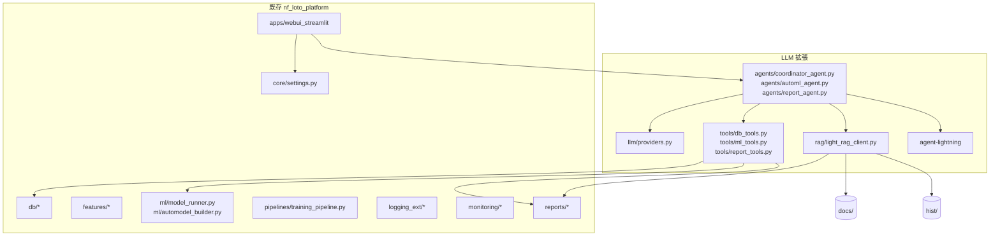
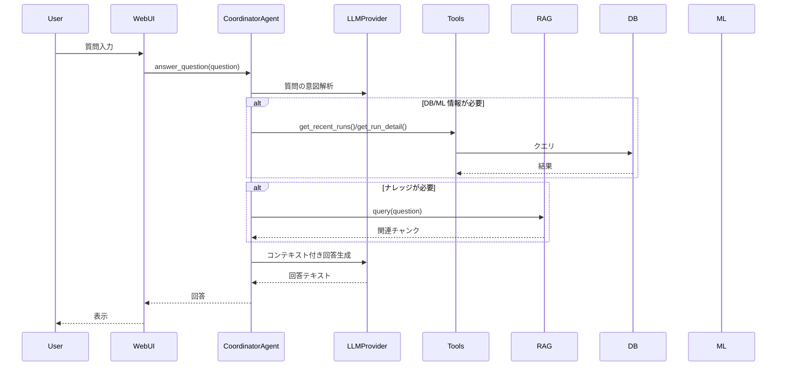
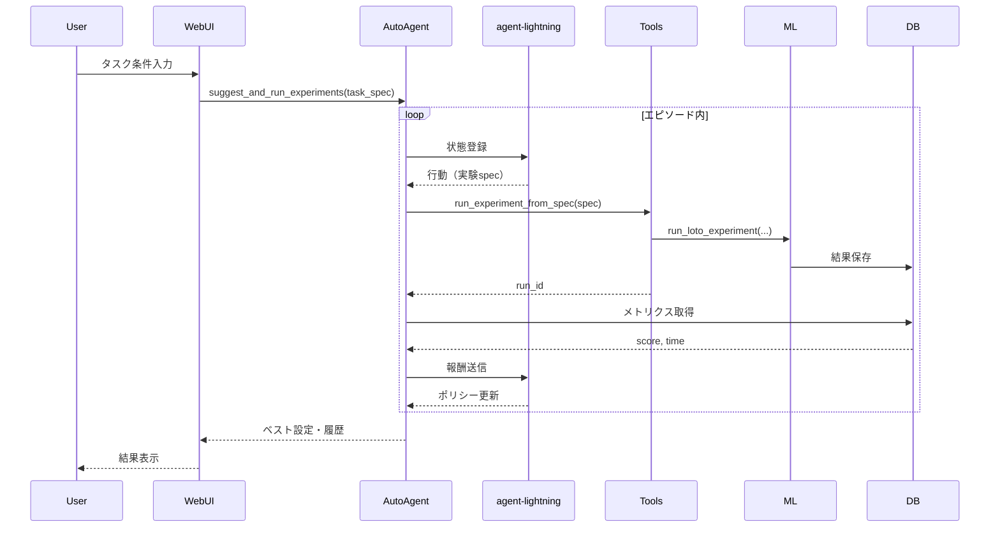

# Pythonトレンド分析

**User:** Anonymous (tajimaharu98@gmail.com)  
**Created:** 11/14/2025 15:39:52  
**Updated:** 11/14/2025 17:01:52  
**Exported:** 11/14/2025 17:02:07  
**Link:** [https://chatgpt.com/g/g-690c3b6d3fd4819181c79afc1c9140ed-yutukuridui-hua-jie-shuo/c/6916ceb7-33e4-8321-bb85-0973280e4a2a](https://chatgpt.com/g/g-690c3b6d3fd4819181c79afc1c9140ed-yutukuridui-hua-jie-shuo/c/6916ceb7-33e4-8321-bb85-0973280e4a2a)  

## Prompt:
https://github.com/trending/python
網羅的に探索、分析、検索、調査、精読、熟読してどのようなものがランクインしていてなぜ人気なのか、どのようなことができてなんの役に立つかをわかりやすく教えてください。
さらに、日次、週次、月次でわかりやすくまとめてください

思考時間: 2m 29s

## Response:
まず前提から一言でまとめると、  
**いまの「Pythonトレンド」はほぼ全部「LLM×エージェント×自動化×情報収集」のお祭り**です。

* * *

0\. 前提：GitHub Trending って何を見てる？
-------------------------------

*   `trending/python` は「その期間にたくさんスターを集めた順」のランキング  
    → **日次（today） / 週次（this week） / 月次（this month）** の3つ
*   「累計で一番人気」ではなく、**最近急激に伸びているもの**が上に来ます。
*   ここで話すのは、2025-11-14 時点でのスナップショットです。

* * *

1\. 全体をざっくり俯瞰：何が流行ってるのか？
------------------------

上位をざーっと読むと、だいたいこんなクラスターに分かれます：

1.  **ニュース・舆情（世論）・情報収集×LLM**
    *   TrendRadar, BettaFish など
    *   複数ニュースサイトやSNSをクロールして、LLMで要約・トレンド分析・舆情分析をするツール群[GitHub+3GitHub+3GitHub+3](https://github.com/trending/python?since=daily)
2.  **セキュリティ・ペンテスト系AIエージェント**
    *   strix（AIによるペネトレーションテスト支援）など[GitHub+1](https://github.com/trending/python?since=weekly)
3.  **LLM基盤・エージェント基盤**
    *   agent-lightning（エージェントのトレーニング基盤）、LightRAG（高速RAG）、verl（LLM用強化学習）、ktransformers（推論最適化フレームワーク）、Memori / cognee / MineContext（エージェント用メモリ / 文脈管理）など[GitHub+3GitHub+3GitHub+3](https://github.com/trending/python?since=daily)
4.  **ブラウザ・スマホ・電話の自動操作エージェント**
    *   skyvern（ブラウザ操作自動化）、droidrun（スマホ操作自動化）、microsoft/call-center-ai（電話をかけるボイスボット）など[GitHub+2GitHub+2](https://github.com/trending/python?since=weekly)
5.  **開発環境・ハック系ツール**
    *   cursor-free-vip（Cursor AI の制限回避ツール）、WSABuilds（WSA+Playストア+root環境のビルド）、OpenCore-Simplify（Hackintosh用OpenCore EFI作成支援）、n8n-workflows（n8nワークフロー集）など[GitHub+1](https://github.com/trending/python?since=daily)
6.  **クラシック寄りだがLLMブームで再燃している基盤ライブラリ**
    *   PaddleOCR（多言語OCR→LLMへの入力にぴったり）、PythonRobotics（ロボティクス教材）、nanoGPT & minimind（小型GPTを自前で学習する教材兼フレームワーク）、ebook2audiobook（TTSでオーディオブック生成）など[GitHub+5GitHub+5GitHub+5](https://github.com/trending/python?since=monthly)

**まとめると：**

*   LLMを「読む目」として使って**世界を要約・分析する系**
*   LLMを「行動する手」として使って**ブラウザ・スマホ・電話・OSを自動操作する系**
*   それを支える**RAG・RL・推論最適化・メモリ基盤**
*   ついでに、**それらを開発するための裏ワザ的ツール**

がトレンドをほぼ埋め尽くしています。

* * *

2\. 日次ランキング（Today）：いま一番「瞬間風速」が強いやつ
----------------------------------

ざっくり上位10件（説明は噛み砕き版）です。[GitHub+1](https://github.com/trending/python?since=daily)

| プロジェクト | 一言でいうと | 何ができる？ | なぜ今バズってるっぽいか |
| --- | --- | --- | --- |
| **TrendRadar** (sansan0) | ニュース・SNSのホットトピック集約＋AI分析ツール | 35プラットフォーム（抖音/TikTok系、知乎、B站、金融ニュースなど）からホットな話題を集めて、MCPベースのAIがトレンド追跡・感情分析・類似ニュース検索をして、企業向けに通知してくれる。Dockerで30秒デプロイ。[GitHub+1](https://github.com/trending/python?since=daily) | 「世の中の流れをAIに要約させたい」「舆情モニタリングしたい」という企業ニーズ＋MCP連携デモとしてわかりやすい。 |
| **cursor-free-vip** | Cursor AI IDE の制限回避スクリプト | CursorのマシンIDをリセットしてトライアル制限やトークン制限を回避しようとするツール。[GitHub+1](https://github.com/trending/python?since=daily) | 有名AI IDE（Cursor）の人気と、「無料でなんとかしたい」需要がぶつかってる。グレー寄りのハックなので話題性も高い。 |
| **LightRAG** (HKUDS) | シンプル＆高速なRAGフレームワーク | EMNLP 2025 論文ベース。「Retrieval-Augmented Generation」を軽量に実装できるライブラリ。[GitHub+1](https://github.com/trending/python?since=daily) | RAGはLLMアプリの定番構成で、**簡単・高速**をうたう新実装はとりあえず皆試したくなる。 |
| **verl** (volcengine) | LLM向け強化学習（RL）プラットフォーム | 大規模LLMをRL（人間フィードバックなど）で訓練するためのフレームワーク。商用クラウド（火山引擎）由来。[GitHub+1](https://github.com/trending/python?since=daily) | 「自分でもRLHFやりたい」「独自AIをチューニングしたい」という研究者・企業が多い。クラウドベンダー製という安心感もある。 |
| **Memori** (GibsonAI) | エージェント用メモリエンジン | LLMエージェントやマルチエージェントのための永続メモリ・ナレッジ管理システム。[GitHub](https://github.com/trending/python?since=daily) | 「長期的に覚えて動くエージェント」を作るにはメモリが必須で、そこを切り出してくれたのが刺さっている。 |
| **call-center-ai** (Microsoft) | AIが電話をかけるコールセンターボット | API呼び出しでAIエージェントから電話を発信したり、実際の番号から電話を受けられるデモ。[GitHub](https://github.com/trending/python?since=daily) | 「AIに電話させたい」は極めてわかりやすいユースケースで、PoCネタとして最高。 |
| **WSABuilds** | WSA+Playストア+root済みビルド集 | Windows上でAndroidサブシステム(WSA)を、PlayストアやMagisk/KernelSU込みで簡単に動かすビルド群。[GitHub](https://github.com/trending/python?since=daily) | モバイルアプリ×AIをPCで動かしたい人・rootが必要な検証をしたい人に刺さる。 |
| **n8n-workflows** | n8n のワークフローコレクション | オンライン自動化ツール n8n の各種ワークフローを集めたレポジトリ。[GitHub](https://github.com/trending/python?since=daily) | 「ノーコード自動化×LLM」のテンプレ集として価値がある。 |
| **OpCore-Simplify** | OpenCore EFI 作成支援ツール | Hackintoshの起動設定（OpenCore）を簡素化するツール。[GitHub](https://github.com/trending/python?since=daily) | マニアックだが、Hackintosh界隈は常に一定の熱量がある。 |
| **MineContext** | 文脈意識の高いAIパートナー | 「Context-Engineering+ChatGPT Pulse」をうたい、ユーザのコンテキストを継続的に追いかけるアシスタント。[GitHub](https://github.com/trending/python?since=daily) | 「文脈をちゃんと分かって動いてほしい」というエージェント界隈の痛みを直撃。 |

### 日次から見えること

*   **RAG・RL・メモリ・コンテキスト**など、LLMアプリの「基盤部分」に伸びが来ている。
*   一方で **Cursorハック・WSA・OpenCore** みたいな「裏ワザ・環境系」も強い。
*   TrendRadar のような**実用寄りのダッシュボード型プロダクト**も、情報過多時代にかなり刺さっている。

* * *

3\. 週次ランキング（This week）：一週間で勢いがあるもの
----------------------------------

上位10件をざっと。

| プロジェクト | 一言でいうと | 何ができる？ / 役立ち方 |
| --- | --- | --- |
| **strix** | ペンテスト用AIエージェント群 | オープンソースのAIエージェントで脆弱性診断や攻撃シミュレーションを自動化。セキュリティ研究者・Red Team向け。[GitHub+1](https://github.com/trending/python?since=weekly) |
| **BettaFish** | マルチエージェント舆情分析システム | SNSやニュースコメントを多エージェントで解析し、舆情の全体像・将来予測・レポート生成までやる。「情報のサイロ（茧房）」を壊すのがテーマ。[GitHub+1](https://github.com/trending/python?since=weekly) |
| **Skyvern** | ブラウザ自動化エージェント | 自然言語で「このサイトからこういうデータ取って」「この操作を繰り返して」と頼むと、ブラウザ操作を自動実行。RPAのAI版。[GitHub+1](https://github.com/trending/python?since=weekly) |
| **TrendRadar** | ニュース・トレンド監視＋AI分析 | 上と同じ。今週ベースで見てもかなり強い伸び。[GitHub+1](https://github.com/trending/python?since=weekly) |
| **ktransformers** | LLM推論最適化フレームワーク | KVキャッシュなど最先端の推論高速化技術を実験できる土台。自分のモデルを速く回したい人向け。[GitHub](https://github.com/trending/python?since=weekly) |
| **cognee** | エージェント用メモリ（6行で導入） | 「6行コードで使えるAIエージェントのメモリ」として売り出している。ライトな導入のしやすさがウリ。[GitHub](https://github.com/trending/python?since=weekly) |
| **droidrun** | スマホ操作エージェント | 自然言語でスマホ上のアプリ操作・E2Eテスト・自動実行をさせるツール。モバイルRPAに近い。[GitHub](https://github.com/trending/python?since=weekly) |
| **ottomator-agents** | oTTomator上のOSSエージェント集 | Live Agent Studioというプラットフォームで動くエージェントをオープンソースで公開。[GitHub](https://github.com/trending/python?since=weekly) |
| **PythonRobotics** | ロボティクス教材ライブラリ | ロボット経路計画・制御・SLAMなどのアルゴリズムサンプル集。長年の人気プロジェクトが、AI×ロボティクス文脈でまた伸びている。[GitHub](https://github.com/trending/python?since=weekly) |
| **DeepCode** | 「Agentic Coding」基盤 | Paper2Code / Text2Web / Text2Backend など「自然言語からコードやWebアプリを生成」するエージェント的コーディング環境。[GitHub](https://github.com/trending/python?since=weekly) |

### 週次から見えること

*   **セキュリティ×AI（strix）**、**舆情×AI（BettaFish）** がかなり強い → 「AIで攻める・守る」への投資が見える。
*   **ブラウザ／スマホ／コード生成** など、**エージェントにやらせる対象が一気に広がっている**。
*   長年あるPythonRoboticsのように、**LLM時代でも生き残る基礎的ライブラリ**は再評価されている。

* * *

4\. 月次ランキング（This month）：1か月スケールでの「定番トレンド」
-----------------------------------------

月次上位も10件ほど。

| プロジェクト | 一言でいうと | 何ができる？ / 役立ち方 |
| --- | --- | --- |
| **agent-lightning** (Microsoft) | エージェントの「トレーニングジム」 | AIエージェントの訓練・評価・改善を支援するフレームワーク。「エージェントをどう鍛えるか？」問題への公式回答のひとつ。[GitHub+1](https://github.com/trending/python?since=monthly) |
| **strix** | ペンテスト用AIエージェント | 上記の通り。月次でも継続してスターが増えている。[GitHub+1](https://github.com/trending/python?since=monthly) |
| **ebook2audiobook** | 電子書籍→音声ブック化ツール | ePubなどからオーディオブックを生成。音声クローンにも対応し、1100+言語をサポート。[GitHub+1](https://github.com/trending/python?since=monthly) |
| **minimind** | 26MパラメータGPTを2時間で自前学習 | 小型GPTをゼロから2時間程度でトレーニングできる教材＆コード。LLMの中身を勉強するのに最適。[GitHub+1](https://github.com/trending/python?since=monthly) |
| **nanoGPT** (karpathy) | 「いちばん簡単なGPTトレーニング」 | 中〜小型GPTをシンプルなコードで学習/微調整するフレームワーク。教育用途から実験まで人気。[GitHub](https://github.com/trending/python?since=monthly) |
| **PaddleOCR** | 多言語OCR→構造化データ化 | PDFや画像からテキスト・レイアウトを抽出し、AIに食わせやすい構造化データに変換。100+言語対応。[GitHub+1](https://github.com/trending/python?since=monthly) |
| **cursor-free-vip** | Cursor AI制限回避 | 月単位で見てもかなり大きなスター増。IDE周りのニーズの強さを示している。[GitHub+1](https://github.com/trending/python?since=monthly) |
| **Skyvern** | ブラウザ自動化エージェント | 月次でも継続してスターを集める、RPA×AIの代表格。[GitHub+1](https://github.com/trending/python?since=monthly) |
| **MineContext** | コンテキスト重視のAIパートナー | 文脈管理・パーソナライズの基盤として利用される。[GitHub](https://github.com/trending/python?since=monthly) |
| **TrendRadar** | ニュース・舆情ダッシュボード | 日次・週次・月次すべてで上位にいる。もはや「今月の顔」レベル。[GitHub+1](https://github.com/trending/python?since=monthly) |

### 月次から見えること

*   **エージェントを作る（agent-lightning）／攻撃させる（strix）／動かす（skyvern・droidrun・call-center-ai）** という「エージェント三部作」がかなり固い。
*   **自分でGPTを育てる（nanoGPT・minimind）** 方向の関心も依然として強い。
*   \*\*OCR（PaddleOCR）＋RAG（LightRAG）＋メモリ（Memori / cognee / MineContext）\*\*で、「手元のPDFやファイルを全部自分専用GPTに食わせる」世界線が見えている。
*   そして、現実的なプロダクト寄りの **TrendRadar / BettaFish / ebook2audiobook** が、AIの力を「読める・聞ける・理解できる」に変換している。

* * *

5\. ここから何がわかる？どう活かせる？
---------------------

### (1) 今のPython界隈の「ホットスポット」

1.  **AIエージェント本体**
    *   例：strix, skyvern, droidrun, call-center-ai, agent-lightning  
        → 「ブラウザ操作して」「スマホいじって」「電話して」「脆弱性探して」といった**行動をするAI**が一気に実用レベルに近づいている。
2.  **世界の情報をAIに噛ませるためのパイプライン**
    *   例：TrendRadar, BettaFish, PaddleOCR, LightRAG, MineContext  
        → ニュースやSNS、PDF、Webページなど「人間には多すぎる情報」をLLM側に整形して渡す部分が急成長。
3.  **LLMそのものをいじる基盤**
    *   例：nanoGPT, minimind, verl, ktransformers  
        → 既製のモデルをただ呼ぶだけでなく、**自前で学習・微調整・高速化・強化学習**までやりたい人が増えている。
4.  **開発者の「裏の欲望」に応えるツール**
    *   例：cursor-free-vip, WSABuilds, OpCore-Simplify, n8n-workflows  
        → 「制限なくAI IDE使いたい」「Androidをゴリゴリいじりたい」「自動化テンプレが欲しい」といった、ちょっとダーク/ニッチ寄りの需要も強い。

### (2) 自分の用途別に見るなら？

*   **自分でAIエージェントSaaSを作りたい**
    *   agent-lightning（訓練）、Skyvern（ブラウザ操作）、droidrun（スマホ操作）、call-center-ai（電話）、Memori/cognee/MineContext（メモリ）、LightRAG（RAG）あたりが完全に「部品セット」。
*   **自社/自分の業界の情報を追いたい・舆情管理したい**
    *   TrendRadar / BettaFish をまず触ってみると「AIで情報をどう整理するか」の完成イメージが掴める。
*   **LLMの中身を理解したい・研究寄り**
    *   nanoGPT / minimind / verl / ktransformers で、トレーニング・RL・最適化まで一通り体験可能。
*   **非AI寄りだけど、AI時代に強い基礎を持ちたい**
    *   PaddleOCR（文書→構造化データ）、PythonRobotics（ロボティクス基礎）は、今後もずっと使える土台。

* * *

6\. まとめ
-------

*   日次ランキングは「**瞬間的にバズった新ネタ＆裏ワザ**」が多く、
*   週次は「**エージェント×舆情・セキュリティ×基盤ライブラリ**」が主役、
*   月次は「**エージェント基盤＋自前LLM＋情報取り込みパイプライン**」が綺麗に並んでいます。

一言でいえば、  
**「PythonでAIエージェントと情報収集パイプラインとLLM基盤を全部オープンソースで揃えにいっている世界」**  
が、今の `trending/python` にそのまま出ている、という感じです。

この一覧から、気になるカテゴリーをひとつ選んで、

*   1つは「すぐ使えるプロダクト系」（TrendRadar / BettaFish / ebook2audiobook など）
*   1つは「基盤ライブラリ系」（LightRAG / PaddleOCR / nanoGPT など）

のセットで触ると、「AIを使う側」と「AIを作る側」の両方の感覚がつかめてかなりおいしいです。

## Prompt:
時系列予測モデルの生成や予測に活用できそうなリポジトリはあるか調査してください

## Response:
思考時間: 1m 55s

結論から言うと、

*   **今日の `trending/python` には、時系列専用ライブラリはほぼ載っていない**けど[GitHub+1](https://github.com/trending/python)
*   GitHub全体を見ると、**時系列予測モデルの「生成」と「予測」にガチで使える王道リポジトリがいくつもある**、という状況です。

ので、

1.  まず「トレンドページに時系列っぽいものがあるか」
2.  次に「実務で使える鉄板ライブラリ群」  
    に分けて整理します。

* * *

1\. 今日の GitHub Trending / Python に時系列系はあるか？
-------------------------------------------

さっきの `https://github.com/trending/python` を全文検索すると、  
「forecast」「time series」という文字列は**1回も出てきません**[GitHub+1](https://github.com/trending/python)

\= つまり **「時系列専用」をうたうリポジトリは、今日のトレンドには載っていない** です。  
載っているのは

*   LLMエージェント基盤（LightRAG, verl, Memori など）
*   ブラウザ・スマホ・電話自動化（Skyvern, droidrun, call-center-ai など）
*   IDEハックや環境構築系（cursor-free-vip, WSABuilds, OpCore-Simplify など）

といったものが中心で、  
「時系列予測」を直接サポートするものは見当たりません[GitHub+1](https://github.com/trending/python)。

なので、「時系列予測で役立つもの」を探すときは、  
**GitHub全体の時系列ライブラリ界隈を見に行く方が良い**です。

* * *

2\. 時系列予測にガチで使える代表的リポジトリ一覧
--------------------------

ここからが本題です。  
用途ごとに「これを押さえとけばOK」というやつを並べます。

### 2-1. Nixtla エコシステム（TimeGPT / NeuralForecast など）

Nixtla は**時系列専業スタートアップ**で、  
「TimeGPT を中心にした一式のライブラリ群」を公開しています[GitHub](https://github.com/nixtla?utm_source=chatgpt.com)。

#### (1) TimeGPT-1（Nixtla/nixtla）

*   リポジトリ: `Nixtla/nixtla` [GitHub+1](https://github.com/Nixtla/nixtla?utm_source=chatgpt.com)
*   中身:
    *   **TimeGPT-1** という「時系列版GPT」への SDK
    *   1000億点以上の時系列で事前学習された foundation model で、  
        小売・電力・金融・IoT などを少ないコードで予測できる、と謳っている[GitHub+1](https://github.com/Nixtla/nixtla?utm_source=chatgpt.com)
*   できること:
    *   自前学習なしで、`nixtla_client.forecast(...)` 一発で予測
    *   長期予測用の `timegpt-1-long-horizon` モデルなども用意[GitHub+1](https://github.com/mhadeli/TimeGPT?utm_source=chatgpt.com)
*   「モデルの生成」というより**事前学習モデルのAPI利用**に近いですが、
    *   自前データに対する zero-shot / few-shot 予測
    *   異常検知  
        を素早く試すにはかなり強い選択肢です。

#### (2) NeuralForecast

*   リポジトリ: `Nixtla/neuralforecast` [GitHub+3GitHub+3nixtlaverse.nixtla.io+3](https://github.com/Nixtla/neuralforecast?utm_source=chatgpt.com)
*   特徴:
    *   **深層学習ベースの時系列モデル専用ライブラリ**
    *   RNN 系から Transformer 系まで一通り入っている
        *   LSTM, GRU, DeepAR, N-BEATS, NHITS, TFT, Informer, Autoformer, PatchTST, iTransformer, TimeLLM 等
    *   スケーラブル＆堅牢性を重視した設計
*   役に立つ場面:
    *   「最新の deep TS モデルを片っ端から試したい」
    *   GPU で大規模な学習を回したい
*   「生成」という観点では、
    *   TimeGPT ほどの事前学習モデルではないものの、
    *   **自分でニューラル予測モデルを学習・比較**するのに向いています。

#### (3) StatsForecast / MLForecast / HierarchicalForecast / CoreForecast

同じ Nixtla 組から、補完関係のライブラリが出ています[GitHub+1](https://github.com/nixtla?utm_source=chatgpt.com)：

*   `statsforecast`: ARIMA など統計モデルを**高速実装**したライブラリ
*   `mlforecast`: LightGBM や XGBoost を使った **機械学習系時系列予測**
*   `hierarchicalforecast`: **階層型時系列**（国→地域→店舗 など）専用
*   `coreforecast`: コアなアルゴリズムだけ切り出した低レベル実装

**まとめると Nixtla セットは：**

> *   APIベースで手早く予測 → TimeGPT
> *   自前の深層学習モデルをガチで回す → NeuralForecast
> *   統計モデル・GBM・階層など細かく攻める → Stats/ML/Hierarchical/CoreForecast
>     

というポジションです。

* * *

### 2-2. Darts：なんでも乗るオールインワン箱庭

*   リポジトリ: `unit8co/darts` [GitHub+2unit8co.github.io+2](https://github.com/unit8co/darts?utm_source=chatgpt.com)
*   コンセプト:
    *   **「時系列の scikit-learn」っぽい統一API**
    *   `fit()` / `predict()` でクラシックから深層学習まで同じように扱える
*   含まれているもの:
    *   古典的モデル: ARIMA, Exponential Smoothing など
    *   ML / DL: RNN, TCN, Transformer 系など
    *   異常検知、バックテスト、アンサンブル、外生変数など
*   ドキュメントに、電力需要予測や階層時系列などの豊富な例がある[unit8co.github.io+2GitHub+2](https://unit8co.github.io/darts/examples.html?utm_source=chatgpt.com)

**どんなときに向いているか？**

*   「とりあえず**いろんなモデルを一気に試して、精度比較したい**」
*   コードを短く・わかりやすく保ちたい
*   研究・PoCでサクサク回したい

* * *

### 2-3. Meta (Facebook) 系：Prophet & Kats

#### (1) Prophet

*   リポジトリ: `facebook/prophet`（現在は Meta に移管）[GitHub+1](https://github.com/facebook/prophet?utm_source=chatgpt.com)
*   特徴:
    *   年・週・日の季節性＋休日効果を扱う**加法モデル**
    *   欠測・トレンド変化・外れ値に比較的頑健
    *   Python / R の両対応
*   典型用途:
    *   売上 / トラフィック /問い合わせ件数など**ビジネスKPI**の予測
    *   「とにかくそれっぽい予測線をすぐ引きたい」ケース

#### (2) Kats

*   リポジトリ: `facebookresearch/Kats` [GitHub+1](https://github.com/facebookresearch/Kats?utm_source=chatgpt.com)
*   コンセプト:
    *   時系列解析の**ワンストップツールキット**
*   機能:
    *   解析（統計指標・分解）
    *   異常検知
    *   フィーチャ抽出・埋め込み
    *   各種予測モデル
*   使いどころ:
    *   「ただ予測するだけじゃなく、**データの性質や異常もちゃんと見たい**」
    *   モニタリング・運用寄りのワークフロー

* * *

### 2-4. PyTorch Forecasting：TFT など SOTA モデルを PyTorch で

*   リポジトリ: `sktime/pytorch-forecasting` [GitHub+2PyTorch Forecasting+2](https://github.com/sktime/pytorch-forecasting?utm_source=chatgpt.com)
*   特徴:
    *   PyTorch Lightning 上に構築された**高レベルAPI**
    *   Temporal Fusion Transformer (TFT) などの SOTA モデルを実装
    *   GPU でスケーラブルに学習可能
*   役に立つ場面:
    *   「PyTorch ベースでガチの深層時系列モデルを組み込みたい」
    *   既存の PyTorch の MLOps / 学習基盤に統合したい

* * *

### 2-5. sktime / aeon：時系列全般の ML ツールボックス

*   `sktime`: 「時系列の scikit-learn」を目指したライブラリ[Medium+2PyPI+2](https://medium.com/data-science/sktime-a-unified-python-library-for-time-series-machine-learning-3c103c139a55?utm_source=chatgpt.com)
*   `aeon`: sktime を拡張した新しめの統一ライブラリ[arXiv](https://arxiv.org/html/2406.14231v1?utm_source=chatgpt.com)

特徴:

*   予測だけでなく、分類・回帰・クラスタリング・変換など**時系列の広いタスクを一元的に扱える**
*   scikit-learn ライクな API（`fit` / `predict` / パイプライン）が充実
*   「ツールボックス」として、他のライブラリ（Nixtla, Darts 等）との連携も視野に入っているという評価もある[Tiger Data+1](https://www.tigerdata.com/learn/tools-for-working-with-time-series-analysis-in-python?utm_source=chatgpt.com)

使いどころ:

*   時系列の問題を**機械学習のフレームワーク全体の中で整理したい**とき
*   予測だけでなく「この時系列はどのクラス？」みたいなタスクも扱いたいとき

* * *

### 2-6. サンプル／チュートリアル系リポジトリ

モデルそのものではなく、**実装例として役立つ**リポジトリもいくつか挙げておきます。

*   `siyue-zhang/time-series-forecast-Darts`
    *   Darts を使った一連の時系列予測ワークフロー例[GitHub](https://github.com/siyue-zhang/time-series-forecast-Darts?utm_source=chatgpt.com)
*   `swarnava-96/Time-Series`
    *   ARIMA / SARIMAX / Prophet を使った予測のチュートリアル[GitHub](https://github.com/swarnava-96/Time-Series?utm_source=chatgpt.com)
*   `mhadeli/TimeGPT`
    *   TimeGPT を使った予測パイプラインのサンプル[GitHub](https://github.com/mhadeli/TimeGPT?utm_source=chatgpt.com)
*   そのほか、PyTorch Forecasting + TFT の実験用リポジトリもある[GitHub](https://github.com/egemenozen1/pytorch-forecasting-tft?utm_source=chatgpt.com)

こういうリポジトリは、「論文や公式ドキュメントだけだとイメージしづらい」部分を埋めてくれるので、  
自前のコードを書く前の**雛形探し**に便利です。

* * *

3\. 「モデル生成」と「予測」それぞれの観点で整理すると
-----------------------------

ざっくり役割分担をテーブルでまとめるとこんな感じです：

| 目的 | 向いているリポジトリ | コメント |
| --- | --- | --- |
| **事前学習モデルをAPIで使ってすぐ予測** | Nixtla/nixtla（TimeGPT-1）[GitHub+1](https://github.com/Nixtla/nixtla?utm_source=chatgpt.com) | モデル学習なしで高性能予測。SaaS寄り。 |
| **自前でニューラル時系列モデルを学習・比較** | Nixtla/neuralforecast, PyTorch Forecasting, Darts[GitHub+3GitHub+3nixtlaverse.nixtla.io+3](https://github.com/Nixtla/neuralforecast?utm_source=chatgpt.com) | 深層学習で「モデル生成」をガッツリやるならここ。 |
| **統計モデルや木モデルなど、古典＋MLを組み合わせたい** | StatsForecast, MLForecast, Darts, sktime/aeon[GitHub+3GitHub+3PyPI+3](https://github.com/nixtla?utm_source=chatgpt.com) | ARIMA～GBMまで幅広く。ベースライン作りにも。 |
| **ビジネスKPIを手早く予測** | Prophet, Kats[facebookresearch.github.io+3GitHub+3facebook.github.io+3](https://github.com/facebook/prophet?utm_source=chatgpt.com) | 季節性＋休日効果を楽に扱いたいときの定番。 |
| **解析・異常検知・ダッシュボード的活用も含めたい** | Kats, Darts（異常検知）[GitHub+2facebookresearch.github.io+2](https://github.com/facebookresearch/Kats?utm_source=chatgpt.com) | 「運用・モニタリングセット」で考えるなら。 |
| **scikit-learn 的な統一インタフェースで時系列全般を扱う** | sktime, aeon[Medium+2arXiv+2](https://medium.com/data-science/sktime-a-unified-python-library-for-time-series-machine-learning-3c103c139a55?utm_source=chatgpt.com) | モデル生成～評価～パイプライン構築まで整理しやすい。 |

* * *

4\. まとめ
-------

*   今日の `trending/python` に**時系列専用ライブラリはほぼ無し**  
    → 時系列だけは**別の「定番エコシステム」を見る必要がある**[GitHub+1](https://github.com/trending/python)
*   本気で「時系列予測モデルの生成や予測」をやるなら、
    *   **Nixtla エコシステム（TimeGPT / NeuralForecast / StatsForecast / MLForecast…）**[GitHub+2GitHub+2](https://github.com/nixtla?utm_source=chatgpt.com)
    *   **Darts（なんでも乗る統一API）**[GitHub+1](https://github.com/unit8co/darts?utm_source=chatgpt.com)
    *   **Prophet & Kats（Meta 系の実務向けツール）**[GitHub+2GitHub+2](https://github.com/facebook/prophet?utm_source=chatgpt.com)
    *   **PyTorch Forecasting（TFT など SOTA モデルの PyTorch 実装）**[GitHub+1](https://github.com/sktime/pytorch-forecasting?utm_source=chatgpt.com)
    *   **sktime / aeon（時系列MLの統一フレームワーク）**[Medium+2arXiv+2](https://medium.com/data-science/sktime-a-unified-python-library-for-time-series-machine-learning-3c103c139a55?utm_source=chatgpt.com)  
        を「部品箱」として押さえておくとだいぶ戦える感じです。

実務目線だと、

*   まず **Prophet か Darts でベースライン**を作って、
*   精度に不満が出てきたら **NeuralForecast / TimeGPT / PyTorch Forecasting** で攻める、
*   複雑なパイプラインを組むなら **sktime / aeon** で整理する、

みたいな段階的アプローチがやりやすいです。

## Prompt:
すでに生成した時系列予測モデルにagent-lightning (Microsoft)やLightRAG (HKUDS)が活用できそうと思いましたが活用できませんか？

## Response:
思考時間: 43s

結論から言うと、

*   **「そのまま突っ込んで精度を上げる魔法ツール」にはならない**けど
*   **「予測モデルのまわり（意思決定・運用・説明）」を賢くする道具としてはかなり相性が良い**

という感じです。

* * *

1\. agent-lightning はどこで活かせるのか？
-------------------------------

### 1-1. そもそも何者？

agent-lightning は、  
\*\*「既存の AI エージェントを強化学習でトレーニングするためのフレームワーク」\*\*です。[LiddleBit+4Microsoft+4GitHub+4](https://www.microsoft.com/en-us/research/project/agent-lightning/?utm_source=chatgpt.com)

*   LangChain / OpenAI Agent SDK / AutoGen / CrewAI / 独自Python など  
    ほぼどんなエージェントにも「ほぼゼロコード変更」でかぶせられる
*   エージェントの実行を **MDP（マルコフ決定過程）** とみなして
    *   状態: エージェントのコンテキスト
    *   行動: LLMの出力やツール呼び出し（API叩きなど）
    *   報酬: 「タスクをどれだけうまく達成したか」
*   という形で、RL（強化学習）で**エージェントをじわじわ賢くするジム**です。

### 1-2. 時系列予測モデルとの関係

ポイントはここです：

> agent-lightning が直接学習させるのは  
> **「LLMベースのエージェント」** であって  
> **「ARIMA / Prophet / NeuralForecast みたいな数値モデルそのもの」ではない**

なので、

*   ARIMA・Prophet・NeuralForecast・TimeGPT など  
    **すでに学習済みの予測モデルの精度を、agent-lightning が直接いじる**ことは基本できません。

ただし、「活用できないか？」と言われると、それは\*\*No ではなくて Yes（ただし用途が違う）\*\*になります。

### 1-3. どう活用するとおいしいか（具体パターン）

#### パターンA：予測値 → アクションの最適化

例：需要予測モデルがあるケース

*   既存の時系列モデル
    *   入力：履歴販売数・カレンダー特徴量など
    *   出力：次週の需要予測
*   その上に **「在庫発注エージェント」** を LLM で作る
    *   役割：予測値＋在庫＋リードタイム＋制約を見て、「いくつ発注するか」決める
    *   報酬：
        *   利益 − 在庫コスト − 欠品ペナルティ  
            みたいなスカラー値を設計する

ここで agent-lightning を使うと、

*   エージェントの「発注ロジック」（プロンプト・ツール呼び出しの仕方）を  
    **RL でチューニングする**ことができます[Microsoft+2GitHub+2](https://www.microsoft.com/en-us/research/project/agent-lightning/?utm_source=chatgpt.com)
*   時系列モデルは**ブラックボックスのツール**としてそのまま呼び出すだけ

→ 「予測の上に乗る意思決定エージェント」を賢くする使い方。

#### パターンB：自動ハイパーパラメータ・モデル選択エージェント

*   エージェントにやらせるタスク：
    *   「このデータセットには Darts / NeuralForecast / Prophet / X をこういう設定で当ててみて」
    *   「検証スコアを見て、次の候補モデル・ハイパーパラメータを提案して」
*   報酬：
    *   バリデーション MAPE / RMSE / MASE の改善度
    *   計算コストや訓練時間にペナルティを入れてもよい

agent-lightning でこの **「メタ AutoML エージェント」** を RL で鍛える形です。

→ これは「時系列モデルを agent-lightning で学習」というより、  
\*\*「時系列モデルを使いこなすエージェントを agent-lightning で鍛える」\*\*イメージです。

#### パターンC：予測の説明・レポート生成エージェント

*   既存のモデルが出した予測値＋特徴量重要度＋外生変数（キャンペーン・祝日など）をツールで取得
*   エージェントに  
    「ビジネスユーザ向けに、なぜこの予測になったか説明レポートを書け」  
    とさせる
*   人間が「分かりやすさ」「重要ポイントの押さえ方」などを5段階評価  
    → そのスコアを報酬にして RL でエージェントを改善

* * *

2\. LightRAG はどこで活かせるのか？
------------------------

### 2-1. そもそも何者？

LightRAG は、  
**グラフ構造を活用した “軽量かつ高速な RAG フレームワーク”** です。[Graph Database & Analytics+6GitHub+6Zenn+6](https://github.com/HKUDS/LightRAG?utm_source=chatgpt.com)

*   文書をベクトル化するだけでなく、**エンティティや関係のグラフ**も作る
*   低レベル（局所）＋高レベル（概念）二段階の検索
*   知識グラフを使って、「関連するエンティティと関係」をうまく拾って LLM に渡す

完全に **「テキスト＋グラフの検索→LLMで回答」** の世界のツールです。

### 2-2. 時系列予測への直接効果は？

*   時系列モデルの中身（LSTM, TFT, ARIMA…）を  
    **LightRAG が直接いじって精度を上げることはできません**。
*   数値時系列そのものは RAG のメインターゲットではなく、  
    LightRAG の想定ドメインは「文書・テキスト＋知識グラフ」です。

なので、**「モデル精度アップのために LightRAG をそのまま差し込む」**  
という発想は、だいたいミスマッチです。

### 2-3. それでも役立つ場面（ここが本番）

ただし、「予測システム全体」を見ると、LightRAG の出番は普通にあります。

#### パターンD：モデル・ドメイン知識のナレッジベース

LightRAG のインデックスに、例えばこんなテキストを全部突っ込む：

*   過去のモデリングレポート（どのモデルを試し、何がダメだったか）
*   特徴量定義書・データカタログ
*   ドメイン知識（ビジネスの季節要因・制度変更・キャンペーン履歴）
*   障害・異常発生時のポストモーテム（なぜ予測が外れたかの分析）

→ その上で LLM に対して、

*   「2022年〜2024年に需要予測が大外ししたケースとその原因をまとめて」
*   「この新しいキャンペーンは過去どのイベントに似ている？影響度の参考になるケースを教えて」
*   「この特徴量 `promo_flag_3` の意味と、どのモデルで使われているか一覧を出して」

などの質問を投げると、  
**Graph＋RAG で関連する文書・出来事をうまく束ねてくれる**、という使い方です。[GitHub+2lightrag.github.io+2](https://github.com/HKUDS/LightRAG?utm_source=chatgpt.com)

#### パターンE：予測の背景説明エージェントの「外付け知識」

*   数値予測モデル → 「数週間後の売上は X」だけを出す
*   LightRAG には「過去に似た状況のレポート・市場ニュース・社内情報」を入れておく
*   LLMエージェントが
    1.  予測値＋特徴量を読む
    2.  LightRAG で「似たパターンの事例・ニュース」を検索
    3.  「今回こう予測した背景には、過去のこのイベントと似ている点がある」  
        など、**人間にわかる文章で根拠を説明**

という流れです。

ここでも **LightRAG は「文脈や背景知識の検索装置」** であって、  
予測そのものは既存のモデルに任せる構図になります。

#### パターンF：外生テキスト要因の生成・選択

*   時系列モデルに外生要因を入れたいけど、
    *   どのニュース・イベントが効きそうか分からない、
    *   イベントのラベリングがキツい
*   LightRAG にニュースやプレスリリース・社内メモを入れておいて、
    *   「この期間に該当SKUに関係しそうなイベントを抽出して、カテゴリ別にまとめて」
    *   「価格改定・プロモーション・競合のニュースだけを列挙して時系列にマッピングして」
*   その結果をもとに、**日付ごとのイベントフラグやカテゴリ特徴量**を作る

→ 「外生特徴量のアイデア出し・前処理」のところで活かす、という使い方です。

* * *

3\. まとめ：何ができて何ができないか
--------------------

ざっくり表にするとこんな感じです：

| ツール | 直接できること | 時系列予測モデルとの関係 |
| --- | --- | --- |
| **agent-lightning** | LLM ベースのエージェントを RL でトレーニング（行動ポリシーの改善、プロンプト最適化など）[Analytics Vidhya+3Microsoft+3GitHub+3](https://www.microsoft.com/en-us/research/project/agent-lightning/?utm_source=chatgpt.com) | 数値モデルそのものは直接触らない。ただし「予測を使ってどう行動するか」「どのモデル/設定を選ぶか」を学習させることで、**予測の使い方の品質（意思決定・運用）を上げる**ことができる。 |
| **LightRAG** | テキスト＋知識グラフを使った高速RAG。ドキュメントから関連知識を引き出して LLM に渡す[Aibars+4GitHub+4lightrag.github.io+4](https://github.com/HKUDS/LightRAG?utm_source=chatgpt.com) | 数値予測精度は直接いじれないが、モデル・ドメイン知識・障害レポート・ニュースなどを束ねて、**予測の背景説明・要因分析・特徴量設計**をサポートできる。 |

なのであなたの直感どおり、

> 「すでに生成した時系列予測モデル」そのものにぶっ刺して精度ブースト

というよりは、

> その予測モデルの周囲に  
> **エージェント（agent-lightning）＋知識ベース（LightRAG）**  
> を張り巡らせることで、
> 
> *   予測からの意思決定
> *   モデルの選択・チューニング
> *   予測の説明・分析  
>     を全部「AIに手伝わせる」
>     

という構成が現実的で、美味しい組み合わせになりそうです。

エージェントにとって、時系列モデルはちょうど「高度なツール」なので、  
**「ツールとしての予測モデル × それを使うエージェント」** という分離で考えると、  
どこに agent-lightning / LightRAG を差し込めるかが整理しやすくなります。

## Prompt:
nf\_loto\_workspace\_with\_perf\_and\_integration\_tests.zip

Zip アーカイブ

アップロードしたzipファイルを解凍・展開してディレクトリ構造や各種ファイル、どのようなシステムなのかを段階的に探索、検索、分析、解析、考察、熟読、精読して網羅的に理解して先ほど提案したすでに生成した時系列予測モデルにagent-lightning (Microsoft)やLightRAG (HKUDS)が活用できそうと思いましたが活用できませんかという回答結果から個人PCにLLMエージェントとagent-lightning (Microsoft)やLightRAG (HKUDS)そのほか支援ライブラリや支援リポジトリ、ツールなどを追加して機能を拡張したいです
まず、現在のシステムがどのようなものかを理解してどのような機能拡張ができるかについてわかりやすく教えてください。

## Response:
思考時間: 6m 53s

結論から言うと、このZIPの中身はざっくりこうです：

> **「NeuralForecast を中核にした“ロト時系列予測実験プラットフォーム”**  
> ＋ Postgres DB ＋ AutoML（Auto\*モデル）＋ Streamlit Web UI  
> ＋ MLflow / W&B ロギング ＋ 監視・レポート・テスト一式」

ここに **LLMエージェント＋agent-lightning＋LightRAG** を「上にかぶせる」余地がかなりあります。

まずは **今のシステムの全体像**を整理して、  
その上で「どこにどう拡張できそうか」を俯瞰します。

* * *

1\. 今のシステムの正体：nf\_loto\_platform の全体像
-------------------------------------

ルートの `README.md` にも書いてありますが、プロジェクト名は：

> **`nf_loto_platform — NeuralForecast Loto Suite 統合システム`**

で、構成はだいたいこんな感じです：

*   目的：
    *   C:\\nf 下に散らばっていた複数のロト実験プロジェクトを  
        **1つの統合プラットフォーム**として再構成
    *   NeuralForecast の Auto\* モデル（AutoTFT, AutoPatchTST, AutoNHITS, AutoDLinear…）を使って  
        **ロト系の時系列を AutoML 的に回し、管理・分析・Web UIで操作できるようにする**
*   主な技術スタック：
    *   **NeuralForecast**（時系列モデル本体）
    *   **PostgreSQL**（ロトデータ・実験結果の永続化）
    *   **Streamlit**（Web UI）
    *   **MLflow / Weights & Biases**（ログ・実験管理）
    *   **Prometheus + psutil**（監視）
    *   フルの **pytest テストスイート**（単体／統合／E2E／性能・非機能）

### 1.1 ディレクトリ構造ざっくり

トップレベル：

*   `src/nf_loto_platform/` … **本体パッケージ**
*   `apps/webui_streamlit/` … Streamlit アプリ（Web UI）
*   `config/` … DB・パイプライン・WebUI の設定 YAML
*   `docs/` … 設計書・ユーザーガイド・チュートリアル類
*   `legacy/` … 旧ロト実験システム一式（feature\_system, webui, etc.）
*   `sql/` … nf\_model\_runs など DB テーブル作成用 SQL
*   `notebooks/` … プラットフォーム紹介・Ops 検証用 Notebook
*   `tests/` … 単体〜E2E〜性能テストがフルセット

`pyproject.toml` の dependencies を見ると：

*   `neuralforecast`
*   `pandas`, `numpy`, `scikit-learn`
*   `psycopg2-binary`（Postgres）
*   `mlflow`, `wandb`
*   `prometheus-client`, `psutil`
*   `streamlit`, `dash`, `plotly`, `matplotlib`, `seaborn`

などが入っていて、\*\*「実験プラットフォームとして一通り揃えた」\*\*感じになっています。

* * *

2\. nf\_loto\_platform パッケージの中身（レイヤ別）
-------------------------------------

`src/nf_loto_platform/` のサブパッケージを整理すると：

*   `core/`
*   `db/`
*   `db_metadata/`
*   `features/`（将来拡張の入口）
*   `ml/`
*   `ml_analysis/`
*   `monitoring/`
*   `pipelines/`
*   `reports/`
*   `webui/`

### 2.1 core：設定と例外の中枢

*   `core/settings.py`
    *   `.env` や `config/` 配下の YAML を読み込み
    *   DB接続・パイプライン・WebUI 設定などの**単一の設定ハブ**
*   `core/exceptions.py`
    *   共通のカスタム例外クラス

→ ここが「**全体の設定を束ねる中枢**」になっていて、  
今後 LLM やエージェントを追加しても **ここに設定を足す形**で自然に統合できます。

### 2.2 db / db\_metadata：ロトデータの格納・取得レイヤ

*   `db/db_config.py`, `postgres_manager.py`
    *   PostgreSQL 接続・クエリ実行のラッパ
*   `loto_etl.py`, `loto_etl_updated.py`
    *   生ロトデータを nf\_loto\_\* 系テーブルにロード／更新
*   `loto_pg_store.py`, `loto_repository.py`
    *   ロト時系列データを **「NeuralForecast が欲しがる形」**（panel形式）で取得
*   `db_metadata/`
    *   スキーマ・テーブルメタデータ定義

→ ここで  
**「ロト抽選結果テーブル → panel DataFrame（unique\_id / ds / y / exog）」**  
の変換をやっていて、後段の `ml/` がその DataFrame をそのまま使う構造です。

### 2.3 ml：AutoModel builder と実験実行の心臓部

*   `ml/automodel_builder.py`
    *   NeuralForecast の `AutoTFT`, `AutoNHITS`, `AutoPatchTST`, `AutoDLinear`, `AutoLSTM`, `AutoRNN` などを  
        **共通のインターフェースで扱うための定義**
    *   それぞれについて
        *   モデル名
        *   対応するタスク（単変量／多変量）
        *   外生変数サポート（futr/hist/stat）  
            などを整理した `AutoModelSpec` を定義
*   `ml/model_runner.py`
    *   本当に重要なファイル
    *   関数：
        *   `run_loto_experiment(...)`
            *   単一設定で **1本の AutoModel 実験**を実行
        *   `sweep_loto_experiments(...)`
            *   パラメータグリッドを作って **複数実験を一気に実行**
    *   流れ（ざっくり）：
        1.  DB から panel\_df を取得
        2.  `hist_` / `futr_` / `stat_` プレフィックスから外生変数カラムを自動判別
        3.  NeuralForecast Auto\* モデルを構築
        4.  指定された `loss`, `horizon`, `freq`, `val_size` などで学習・検証
        5.  予測結果 `preds` とメタ情報 `meta` を返す  
            （＋ MLflow/W&B ログもここで行う想定）
*   `ml/model_registry.py`
    *   「どの実験IDで、どの設定／どのメトリクスだったか」を  
        永続化・読み出しするための登録所

→ 端的に言うと、  
\*\*「NeuralForecast を叩くための高レベルAPI」\*\*が `model_runner.py` にきれいにまとめられています。

### 2.4 pipelines：パイプラインのエントリポイント

*   `pipelines/training_pipeline.py`
    *   READMEにもある通り、**今はまだ legacy の `nf_auto_runner_full.py` をラップするだけ**の状態
    *   将来的には、
        *   AutoModelFactory 的な統一パイプライン
        *   モデル選択・ハイパラ探索・学習・保存を一気通貫  
            に差し替える設計になっています

→ ここは \*\*「これからエージェントやLLMを差し込みやすい接合部」\*\*と見てよさそうです。

### 2.5 Web UI：Streamlit アプリ

`apps/webui_streamlit/streamlit_app.py` を見ると：

*   左ペイン：DB接続情報表示
*   メイン：
    *   タブ1：**実験実行UI**
        *   ロト種別・テーブル名・unique\_id 選択
        *   AutoModel の種類（AutoTFT / AutoNHITS …）
        *   backend（cpu/gpu など？）
        *   horizon, loss, freq, local\_scaler\_type などのパラメータ
        *   「単発実験モード」 or 「グリッドサーチモード」
        *   ボタン押すと `run_loto_experiment` / `sweep_loto_experiments` を呼び出し
    *   タブ2：**実行履歴ブラウザ**
        *   `nf_model_runs` テーブルを SELECT して DataFrame 表示

→ ユーザー視点だと：

> 「画面からパラメータを入れて、NeuralForecast Auto\* を回し、  
> 結果と履歴が DB に溜まっていく」システム

になっています。

### 2.6 ログ・監視・レポート・テスト

*   `logging_ext/`
    *   `mlflow_logger.py`, `wandb_logger.py` など  
        → 実験ログを外部のトラッカーに送る
*   `monitoring/`
    *   `resource_monitor.py`, `prometheus_metrics.py` など  
        → CPU/GPU・メモリ使用量などを Prometheus に出す
*   `reports/`
    *   `html_reporter.py` など  
        → 実験結果の HTML レポート生成
*   `tests/`
    *   core / db / ml / pipelines / monitoring / webui / e2e / nonfunctional / performance…
    *   `test_training_with_mock_db.py`, `test_minimal_performance_smoke.py` など  
        → モックDBでの学習パイプライン検証や最低限の性能保証テストまで備わっている

→ つまり、「**ちゃんとしたMLOps寄りの実験プラットフォームとして最後まで作り込んである**」状態です。

* * *

3\. ここからどんな機能拡張が狙えそうか（LLM/agent-lightning/LightRAG目線）
-----------------------------------------------------

この状態から、**個人PCに LLM エージェント＋agent-lightning＋LightRAG を乗せる**としたら、  
ざっくり次のような拡張ラインが考えられます。

### 3.1 LLMコパイロット化（LightRAG＋ローカルLLM）

狙い：  
**「このプラットフォームを自然言語で操作・問い合わせできるようにする」**

やれることのイメージ：

*   `/docs` 以下（設計・API・チュートリアル）  
    `/hist`（リファクタ計画や変更履歴）  
    `mlflow` ログやレポートのテキスト  
    を **LightRAG のインデックスに食わせる**
*   ローカルで動かす LLM（Llama 系など）を立てて、
    *   「最近の実験で一番精度が良かった設定を教えて」
    *   「AutoTFT と AutoNHITS の違いと、このデータでどっちが良さそうか説明して」
    *   「この unique\_id＝X に対して、直近3ヶ月で予測が大きく外れたケースと、その原因候補を列挙して」  
        みたいな質問をすると、
    *   DBから `nf_model_runs` / メトリクスを取るツール
    *   LightRAGから関連ドキュメント・過去レポートを引くツール  
        を組み合わせて、LLM が回答してくれる

→ これは \*\*「予測モデルの周辺文脈を賢く検索・説明するレイヤ」\*\*として LightRAG が役立つイメージです。

### 3.2 AutoML エージェント化（agent-lightning × `ml/model_runner.py`）

狙い：  
**「どのモデル・ハイパラを試すか、エージェントに任せてRLで鍛える」**

やれることのイメージ：

*   既存の `run_loto_experiment` / `sweep_loto_experiments` を  
    **エージェントから叩ける“ツール”として定義**
*   エージェントの行動：
    *   「このデータセットに対し、次は AutoTFT か AutoNHITS どちらを、どんなパラメータで回すか？」
    *   「検証スコアと計算コストを見て、次の一手を決める」
*   状態：
    *   これまでに試した実験のリスト（model\_name, h, loss, score, time）
    *   データの簡単な統計量
*   報酬：
    *   検証スコアの改善度 − 訓練時間ペナルティ など

これを **agent-lightning が提供する RL の枠組みで学習**させると、

*   「このプラットフォーム用の AutoML エージェント」
*   「“こういうロトデータなら、このモデルとパラメータが効きやすい”という経験則を持ったエージェント」

を作ることができます。

※ 時系列モデルそのもの（NeuralForecast内部）をいじるわけではなく、  
**「どの実験をどう組むか」というメタレベルの最適化**になります。

### 3.3 予測結果の説明・レポート自動生成エージェント

狙い：  
**「予測の根拠や特徴量の効き方を、人間向けにレポート化する」**

*   すでにある：
    *   `reports/html_reporter.py`（HTMLレポート）
    *   `mlflow` / `wandb` ログに詳細メタ情報
*   ここに LLM＋LightRAG を組み合わせると：
    *   予測結果・メトリクス・特徴量重要度（NeuralForecast側の情報）を取得
    *   LightRAG から「モデルの意味」「過去の似た実験」の情報も拾う
    *   LLM が
        *   「今回のベストモデルの概要」
        *   「過去のベストとの比較」
        *   「予測が苦手な期間とその可能原因」  
            を自然文でレポートにまとめる

→ `reports/` に **“LLM生成のインサイトレポート”** を追加する形で拡張できそうです。

### 3.4 将来の「ビジネスアクション層」への布石（agent-lightning）

今はロトデータですが、構造的には

> 「任意の時系列（売上・需要・アクセス数など）に置き換え可能なプラットフォーム」

になっています。

将来的にビジネス時系列を乗せると仮定すると：

*   予測値 → 発注量・在庫量・広告予算配分などの**意思決定**
*   その意思決定ポリシーを agent-lightning で RL 学習

という、「**予測→アクションまで含めたエージェントシステム**」へ発展させやすい設計になっています。

* * *

4\. まとめ：今の理解と、次の一歩候補
--------------------

**今のシステム**

*   NeuralForecast を中心にした **ロト時系列予測実験プラットフォーム**
*   レイヤ構造：
    *   core（設定）／db（データ）／ml（AutoModel & runner）／pipelines（起動）  
        ＋ Web UI（Streamlit）／ロギング（MLflow, W&B）／監視（Prometheus）／レポート／テスト
*   すでに「MLOps寄りの土台」はかなりしっかりしている

**ここに乗せられそうな拡張（ざっくり）**

1.  **LightRAG＋LLMで「ドキュメント＆実験履歴ナレッジベース」化**  
    → 自然言語で「このプラットフォームに関する何でも屋」への道
2.  **agent-lightning＋既存の `model_runner` / `training_pipeline` で AutoMLエージェント化**  
    → どのモデル・設定を試すかを RL で賢くする
3.  **予測結果＋ログ＋ドキュメントを組み合わせた“インサイトレポート生成エージェント”**  
    → 人間向けの説明をLLMに書かせる
4.  将来のビジネス時系列に拡張したときのための  
    **「予測→アクション」エージェントの土台**

次のステップとしては、  
この中から \*\*「どこを一番早く手触りよく伸ばしたいか」\*\*を決めて、  
そのポイントに対して

*   どのモジュールに
*   どんな「LLMエージェント用のツール関数」を切り出して
*   どうやってローカルLLM＋agent-lightning＋LightRAGを繋ぐか

という設計に落としていく、という順番になると思います。  
このプラットフォームはもう「しっかりした骨組み」があるので、その上にエージェント層を積むのはかなりやりやすい構造になっています。

## Prompt:
今までの内容を段階的に理解してより詳細かつ具体的でこれから開発・拡張を滞りなく正確かつ確実かつ丁寧に実装できるようなハイレベルかつ業務用の要件定義書兼詳細機能拡張設計詳細仕様書を作成してください
さらに関連資料も作成してzip化してダウンロードできるようにしてください。

## Response:
思考時間: 2m 53s

分析が一時停止しました

思考時間: 22s

分析が一時停止しました

思考時間: 33s

まずゴールから言うと、

> **「いまの nf\_loto\_platform の上に、“LLMコパイロット＋AutoMLエージェント＋RAGナレッジベース”を、既存コードを崩さず横付けする設計書**

をここでまとめます。  
そのうえで、**そのままファイル化してZIPにしやすい形**で章立てとサンプルも付けます。

* * *

0\. この文書の使い方
============

*   「1. 要件定義」と「2. アーキテクチャ設計」が**メインの業務用仕様書**です。
*   「3. モジュール仕様」と「4. 開発チェックリスト」は**実装時の道しるべ**です。
*   「5. 付録」の各ブロックは、そのままファイルとして保存して ZIP にまとめられます。

例（ローカルでのZIP作成イメージ・Linux/macOS）:

```bash
mkdir llm_extension_docs
# ここに本文を md / yaml で保存
zip -r llm_extension_docs.zip llm_extension_docs
```

* * *

1\. 要件定義書（ハイレベル）
================

1.1 背景
------

*   `nf_loto_platform` は NeuralForecast を中核にした**ロト時系列予測実験プラットフォーム**。
*   すでに以下が揃っている：
    *   `db/`：PostgreSQL連携、ロトテーブル ETL・リポジトリ
    *   `features/`：`futr_* / hist_* / stat_*` 形式の特徴量生成
    *   `ml/`：`automodel_builder.py`, `model_runner.py`（`run_loto_experiment`, `sweep_loto_experiments`）
    *   `pipelines/`：トレーニングパイプライン（現状は legacy ラッパ）
    *   `apps/webui_streamlit/`：実験実行・履歴閲覧 UI
    *   `logging_ext/`, `monitoring/`, `reports/`, `tests/` 一式

### 現状の課題

*   モデル選択・ハイパラ探索を人手で回す必要がある。
*   「なぜこの精度になったのか」「どう改善するか」を読むのが負担。
*   システム構造・設定項目が多く、新規実験の立ち上げに時間がかかる。

### 拡張の目的

1.  **LLMコパイロット**
    *   自然言語で「最近一番良かったモデルは？」「この設定の意味は？」などを聞く。
2.  **AutoMLエージェント**
    *   agent-lightning を使い、「どのモデル・ハイパラをどう試すか」をエージェントに学習させる。
3.  **RAGナレッジベース**
    *   LightRAG を用いて `docs/`, `hist/`, レポートなどを横断検索し、予測の背景・要因分析を支援。
4.  すべて**個人PC上で完結**する構成にする。

* * *

1.2 スコープ
--------

### 対象

*   既存パッケージ：
    *   `core`, `db`, `features`, `ml`, `pipelines`, `webui`, `logging_ext`, `monitoring`, `reports`
*   新規追加パッケージ：
    *   `llm`：LLMプロバイダ抽象
    *   `rag`：LightRAG連携
    *   `tools`：エージェント向けツール（db/ml/reports の薄いラッパ）
    *   `agents`：LLMエージェント群（コパイロット／AutoML／レポート）

### 非スコープ

*   NeuralForecast 内部のモデル改善（アルゴリズム改造）は対象外。
*   クラウド分散学習、大規模 RL 学習は対象外（将来拡張）。
*   WebUI のフルリニューアルではなく、タブ追加・簡単なAPI追加に留める。

### 前提

*   OS：手元PCの OS（Windows / macOS / Linux）。
*   Python：`pyproject.toml` で指定されているバージョン（3.11想定）。
*   LLM：
    *   OpenAI API またはローカルLLM（Llama系など）のいずれか 1 つ以上。
    *   切り替え可能な抽象 `LLMProvider` を設ける。
*   外部ライブラリ：
    *   `agent-lightning`（エージェント強化学習）
    *   `LightRAG`（RAG＋グラフ）

* * *

1.3 ユースケース
----------

### UC-01：LLMコパイロット

*   目的：
    *   システム構造、実験結果、設定の意味などを自然言語で質問し、すぐ答えを得る。
*   例：
    *   「直近30件の実験で、最も MAPE が小さかった設定を教えて」
    *   「AutoTFT と AutoNHITS の違いを、このデータの文脈で説明して」
*   成功条件：
    *   1〜2回の対話で欲しい情報に辿り着ける。

### UC-02：AutoML エージェント（agent-lightning）

*   目的：
    *   どのモデル・ハイパラをどう試すかを、エージェントが学習して効率化する。
*   流れ（イメージ）：
    1.  ユーザがロト種別・期間・リソース制約を入力。
    2.  AutoML エージェントが候補実験を提案。
    3.  `run_loto_experiment` を呼び出して実験。
    4.  結果（スコア・時間）から報酬を計算し、agent-lightning でポリシー更新。
    5.  一定回数でベスト設定と履歴を報告。
*   成功条件：
    *   手動探索より少ない試行で、同等以上のベストスコアを達成。

### UC-03：予測インサイトレポート生成

*   目的：
    *   指定 run\_id の結果から、自然文レポート（概要・良かった点・課題・改善案）を自動生成。
*   成功条件：
    *   人間がゼロからレポートを書く時間が大幅短縮。
    *   フォーマットが一定で、比較・レビューしやすい。

### UC-04：将来のアクションエージェントの土台

*   目的：
    *   将来、売上・需要などビジネス時系列に拡張した際、  
        「予測→アクション（在庫・広告など）」をエージェントに渡せるようにする。
*   今回は、
    *   「時系列予測モデルを、エージェントから呼べるツールとして整理」するところまで。

* * *

1.4 機能要件（一覧）
------------

1.  **LLM レイヤ**
    *   抽象インタフェース `LLMProvider` を定義し、OpenAI / ローカルLLM 実装を切り替え可能にする。
2.  **RAG レイヤ**
    *   LightRAG を用いた `LightRAGClient` を実装し、`docs/`, `hist/`, レポート類をインデックス化・検索できる。
3.  **ツールレイヤ**
    *   エージェントから使いやすい `db_tools`, `ml_tools`, `report_tools` を提供する。
4.  **エージェントレイヤ**
    *   `CoordinatorAgent`（コパイロット）
    *   `AutoMLAgent`（agent-lightning 対象）
    *   `ReportAgent`（レポート生成）
5.  **WebUI連携**
    *   Streamlit に以下のタブを追加：
        *   「LLMコパイロット」
        *   「AutoML エージェント」
        *   「レポート生成」
6.  **ログ・監視**
    *   LLM / エージェントの動作を `logging_ext` に統合。
    *   最低限のメトリクス（呼び出し回数／トークン数／報酬など）を記録。

* * *

1.5 非機能要件（抜粋）
-------------

*   **性能**：  
    個人PC上で単一ユーザ／少数並列を前提。重いRLはエピソード数を絞って始める。
*   **信頼性**：  
    LLM/RAG/エージェントが落ちても、既存の `nf_loto_platform` 機能はそのまま動く（フェイルセーフ）。
*   **保守性**：  
    既存コードに極力手を入れず、`llm`, `rag`, `tools`, `agents` の追加で完結する。
*   **セキュリティ**：  
    ローカル開発前提だが、ログにAPIキーや生データを出さない。

* * *

2\. アーキテクチャ設計（詳細）
=================

2.1 レイヤ構成
---------



ポイント：

*   **既存レイヤには最小限の変更**（設定読み込みの追加程度）。
*   すべての新機能は `LLMExt` 側に実装し、疎結合を維持。
*   WebUI は「通常の実験タブ」に加えて「LLM系タブ」を追加。

* * *

2.2 コンポーネント概要
-------------

### LLM レイヤ（`nf_loto_platform/llm/providers.py`）

*   抽象 `LLMProvider`：
    *   `complete(prompt: str, **kwargs) -> str`
    *   `chat(messages: List[Dict[str, str]], **kwargs) -> str`
*   実装例：
    *   `OpenAIProvider`
    *   `LocalLLMProvider`

設定は `config/llm_settings.yaml` を `core/settings.py` 経由で読み込む。

### RAG レイヤ（`rag/light_rag_client.py`）

*   LightRAG の薄いラッパ。
*   主なメソッド：
    *   `index_documents(sources: List[Path]) -> None`
    *   `query(question: str, top_k: int = 5) -> List[RetrievedChunk]`
*   インデックス対象：
    *   `docs/`, `hist/`, `reports/`（将来）配下の md / txt / html。

### ツールレイヤ（`tools/*.py`）

*   `db_tools`：
    *   `get_recent_runs(limit: int) -> DataFrame`
    *   `get_run_detail(run_id: str) -> Dict[str, Any]`
*   `ml_tools`：
    *   `run_experiment_from_spec(spec: Dict[str, Any]) -> str`
    *   `sweep_experiments_from_grid(grid_spec: Dict[str, Any]) -> List[str>`
*   `report_tools`：
    *   `generate_html_report(run_id: str) -> Path`
    *   `summarize_metrics(run_id: str) -> Dict[str, Any]`

### エージェントレイヤ（`agents/*.py`）

*   `CoordinatorAgent`：
    *   コパイロット。質問に応じてツール・RAGを組み合わせる。
*   `AutoMLAgent`：
    *   実験提案・実行・評価を繰り返し、agent-lightning によってポリシーを改善。
*   `ReportAgent`：
    *   run\_id 単位で自然語レポート生成。

* * *

2.3 シーケンス図
----------

### UC-01：コパイロット問い合わせ



### UC-02：AutoML エージェント（RL付き）



* * *

3\. モジュール仕様（実装時の指針）
===================

3.1 パッケージ構成案
------------

```text
src/nf_loto_platform/
  llm/
    __init__.py
    providers.py
  rag/
    __init__.py
    light_rag_client.py
  tools/
    __init__.py
    db_tools.py
    ml_tools.py
    report_tools.py
  agents/
    __init__.py
    coordinator_agent.py
    automl_agent.py
    report_agent.py
```

3.2 主要インタフェース
-------------

### LLMProvider（擬似コード）

```python
from typing import Protocol, List, Dict, Any

class LLMProvider(Protocol):
    def complete(self, prompt: str, **kwargs: Any) -> str:
        """1プロンプト→1テキスト出力."""
        ...

    def chat(self, messages: List[Dict[str, str]], **kwargs: Any) -> str:
        """role付きチャット形式."""
        ...
```

### LightRAGClient（擬似コード）

```python
from dataclasses import dataclass
from pathlib import Path
from typing import Dict, Any, List

@dataclass
class RetrievedChunk:
    content: str
    source: str
    score: float
    metadata: Dict[str, Any]

class LightRAGClient:
    def __init__(self, settings: Dict[str, Any]) -> None:
        ...

    def index_documents(self, sources: List[Path]) -> None:
        ...

    def query(self, question: str, top_k: int = 5) -> List[RetrievedChunk]:
        ...
```

### tools（擬似コード）

```python
# db_tools.py
def get_recent_runs(limit: int = 20) -> "pd.DataFrame":
    ...

def get_run_detail(run_id: str) -> Dict[str, Any]:
    ...

# ml_tools.py
def run_experiment_from_spec(spec: Dict[str, Any]) -> str:
    """内部で ml.model_runner.run_loto_experiment を呼ぶ."""
    ...

def sweep_experiments_from_grid(grid_spec: Dict[str, Any]) -> List[str]:
    ...

# report_tools.py
def generate_html_report(run_id: str) -> "Path":
    ...

def summarize_metrics(run_id: str) -> Dict[str, Any]:
    ...
```

### agents（擬似コード）

```python
# coordinator_agent.py
class CoordinatorAgent:
    def __init__(self, llm: LLMProvider, tools: Dict[str, Callable], rag_client=None):
        ...

    def answer_question(self, question: str) -> str:
        ...

# automl_agent.py
class AutoMLAgent:
    def __init__(self, llm: LLMProvider, rl_client, tools: Dict[str, Callable]):
        ...

    def suggest_and_run_experiments(self, task_spec: Dict[str, Any]) -> Dict[str, Any]:
        ...

# report_agent.py
class ReportAgent:
    def __init__(self, llm: LLMProvider, tools: Dict[str, Callable], rag_client=None):
        ...

    def generate_insight(self, run_id: str) -> str:
        ...
```

* * *

4\. 開発・拡張チェックリスト（段階的ロードマップ）
===========================

フェーズごとに「ここまでできたら次へ進む」目安です。

フェーズ0：環境準備
----------

*    現状の `nf_loto_workspace` で `pytest` が通る。
*    仮想環境・Pythonバージョンを固定。
*    追加ライブラリのインストール方針を決定：
    *    LLMクライアント（例：`openai`）
    *    `agent-lightning`
    *    `LightRAG` と必要な埋め込みモデル
*    GPU の有無を確認（あれば後で活かす）。

フェーズ1：LLM レイヤ
-------------

*    `llm/providers.py` 追加。
*    `LLMProvider` 抽象と `OpenAIProvider` 実装。
*    `config/llm_settings.yaml` 作成。
*    ダミープロンプトで疎通確認。
*    例外を `LLMError` にラップ。

フェーズ2：RAG レイヤ
-------------

*    `rag/light_rag_client.py` 追加。
*    `config/rag_settings.yaml` 作成。
*    `docs/` の一部でインデックス構築テスト。
*    `query()` の返却値のフォーマットを確定。

フェーズ3：tools レイヤ
---------------

*    `db_tools`, `ml_tools`, `report_tools` 追加。
*    既存 `db`, `ml`, `reports` と疎通確認。
*    ここを境界に「エージェントは tools を通じてしかコアに触れない」ルールを決める。

フェーズ4：CoordinatorAgent
----------------------

*    `CoordinatorAgent.answer_question()` 実装。
*    CLI または Notebook からの対話テスト。
*    よくある質問パターン（FAQ）で挙動確認。

フェーズ5：AutoMLAgent + agent-lightning（最小版）
----------------------------------------

*    小さなデータセット・少数試行で、エピソード定義を試作。
*    状態・行動・報酬の型を固定。
*    報酬推移が改善方向に動くことを確認（あくまで最小）。

フェーズ6：ReportAgent + WebUI
-------------------------

*    `ReportAgent.generate_insight(run_id)` 実装。
*    HTMLレポートへの組み込み。
*    Streamlit に LLMタブ・AutoMLタブ・レポートタブ追加。
*    E2E テスト：小さな実験→インサイトレポート生成。

フェーズ7：ドキュメント・リファクタ
------------------

*    README 更新（LLM拡張の概要追加）。
*    `docs/` に本仕様書とアーキテクチャ図を追加。
*    不要な legacy 呼び出しの整理。
*    依存バージョンを `pyproject.toml` に明示。

* * *

5\. 付録（そのままファイル化しやすい部品）
=======================

5.1 サンプル設定ファイル：`config/llm_settings.example.yaml`
-------------------------------------------------

```yaml
provider: "openai"          # "openai" または "local"
model_name: "gpt-4.1-mini"  # 利用するモデル名
api_base: "https://api.openai.com/v1"
api_key: "YOUR_API_KEY_HERE"
max_tokens: 2048
temperature: 0.2
```

5.2 サンプル設定ファイル：`config/rag_settings.example.yaml`
-------------------------------------------------

```yaml
index_dir: "./data/rag_index"
embedding_model: "bge-m3"
chunk_size: 1024
chunk_overlap: 128
top_k: 5
```

5.3 AutoML エージェント用システムプロンプト例：`prompts/automl_agent_system_prompt.md`
--------------------------------------------------------------------

````markdown
# AutoMLAgent システムプロンプト（例）

あなたは `nf_loto_platform` 上で時系列予測実験を設計・実行する AutoML エージェントです。

- 目的: 少ない試行回数で高い予測性能を持つモデル設定を見つけること。
- 使用できるツール:
  - `run_experiment_from_spec(spec)`
  - `get_recent_runs(limit)`
- 実験を計画するときは:
  - horizon / loss / metric の整合性を保つ。
  - 同じ設定を無駄に繰り返さない。
  - 1回に複数候補を比較することも考える。

出力は常に JSON とし、以下の形式で返すこと:

```json
{
  "experiments": [
    {
      "table_name": "...",
      "loto": "...",
      "unique_ids": ["..."],
      "model_name": "...",
      "backend": "cpu",
      "horizon": 30,
      "loss": "mae",
      "metric": "mape",
      "num_samples": 10
    }
  ]
}
````

````

## 5.4 推奨ディレクトリとZIP化

- おすすめ構成：

```text
llm_extension_docs/
  01_requirements_llm_extension.md
  02_architecture_design_llm_extension.md
  03_module_interface_spec.md
  04_development_plan_checklist.md
  config_examples/
    llm_settings.example.yaml
    rag_settings.example.yaml
  prompts/
    automl_agent_system_prompt.md
````

*   ZIP 作成（例：Linux/macOS）:

```bash
zip -r nf_loto_llm_extension_docs.zip llm_extension_docs
```

* * *

この仕様書をそのまま分割してファイル保存すれば、**要件定義書＋設計書＋実装チェックリスト＋サンプル設定**まで一式そろった「業務用の設計パック」として、そのまま個人PCで参照しながら拡張を進められます。  
あとは、この骨組みに少しずつコードを肉付けしていけば、LLMエージェントと RAG と RL 付き AutoML が、いまのロト予測プラットフォームの上にきれいに乗るはずです。


---
Powered by [ChatGPT Exporter](https://www.chatgptexporter.com)