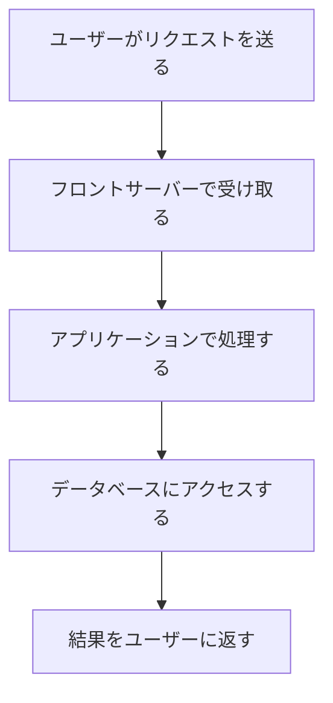
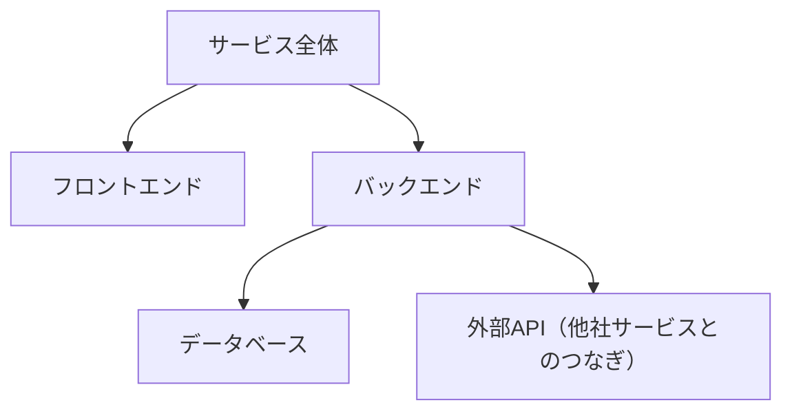
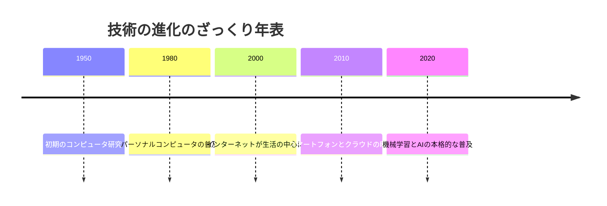
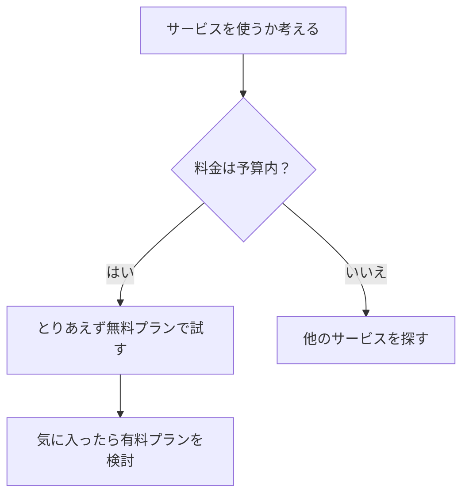

# ファイル解析レポート

**User:** Anonymous (tajimaharu98@gmail.com)  
**Created:** 11/17/2025 9:54:56  
**Updated:** 11/17/2025 10:07:37  
**Exported:** 11/17/2025 10:08:06  
**Link:** [https://chatgpt.com/c/691a725f-5fac-8323-ad84-cf0e69767c76](https://chatgpt.com/c/691a725f-5fac-8323-ad84-cf0e69767c76)  

## Prompt:
subtitles.zip

Zip アーカイブ

アップロードしたzipファイルを解凍、展開して中のファイルを解析して文体や構造、話し方の特徴を分析してレポートを作成してください

## Response:
思考時間: 5m 41s

解析した字幕一式について、ざっくりこんな感じでまとまりました👇

* * *

1\. データのざっくり概要
--------------

*   対象ファイル：日本語字幕（`.srt`）48本
*   台詞行数：約 **2.1万行**
*   推定された文（「。！？？」などで区切ったもの）：約 **1,500 文**
*   1文の長さ：平均約 **30文字**（中央値約25文字）で、字幕として読みやすい長さ

文字種のざっくり比率はこんな感じです：

*   ひらがな：約 **50%**
*   漢字：約 **27%**
*   カタカナ：約 **15%**
*   英字・数字・その他：約 **8%**

→ 専門用語や固有名詞だけカタカナ／英字で、説明部分はひらがな多め。読みやすさ重視のバランスです。

* * *

2\. 文体の特徴
---------

### 2-1. 口語寄りの話し言葉スタイル

*   字幕行ごとの文末をざっくり分類すると
    *   カジュアル系（〜だ、〜じゃない、〜だよね など）：約 **66%**
    *   敬体系（〜です、〜ます、〜でした など）：約 **34%**
*   つまり **基本は常体（〜だ・である）ベース** だけど、
    *   説明部分や丁寧に言いたいところで「です・ます」も混ざる **ハイブリッド型**。

フィラー（間をつなぐ言葉）がかなり多く出てきます：

*   「まあ」：100回以上
*   「なんか」「てか」：それぞれ40回前後
*   「だから」「一応」「とりあえず」「正直」「逆に」なども頻出

→ 実際にしゃべっているような「考えながら話す」感が強いです。

### 2-2. 語彙の傾向

**① 技術・ネット文化系の語彙が多い**

カタカナ語の出現上位には：

*   「シミュレーション」「システム」「データ」「モデル」「ユーザー」「ドメイン」「ファイル」
*   「サイト」「ゲーム」「プロジェクト」「チャンネル」「インフラ」 など

→ IT・ネット文化・科学・都市伝説系の話題が中心のチャンネルであることがうかがえます。

**② ネットスラング・掲示板ノリ**

*   「クソ〜」「草」「〜ンゴ」「w」など、ネットスラングが各所に登場
*   ただしスラング一色ではなく、
    *   スラング＝“ツッコミ”部分
    *   その前後は真面目な説明  
        という役割分担がはっきりしています。

### 2-3. 一人称・二人称の使い方

ざっくりカウントすると：

*   一人称
    *   「私」：600回以上
    *   「俺」：50回前後
    *   「自分」：80回前後
    *   「うち」もそれなりに登場
*   二人称
    *   「あなた」：100回前後
    *   「君」：70回前後
    *   「お前」：30回強

→

*   基本の語り手は「私」だが、
*   場面やキャラによって「俺」「うち」「お前」などを使い分けていて、
    *   シーンごとの距離感や温度を演出している感じがあります。

* * *

3\. 構造の特徴（文章・話の組み立て）
--------------------

### 3-1. 動画全体の典型パターン（推定）

字幕全体を眺めると、多くの動画が次のような構造に見えます：

1.  **導入（フック）**
    *   「今回は〜について」「〜という奇妙な話がある」といった形で、  
        視聴者の好奇心を刺激する一言からスタートするパターンが非常に多い（「今回は」は120回以上）。
2.  **背景説明**
    *   歴史・科学・技術・社会背景などを整理しながら話を進める。
    *   「まず」「次に」「一方で」「しかし」といった論理マーカーが多い。
        *   「まず」：約250回
        *   「次に」：70回前後
        *   「最後に」：30回ほど
        *   「しかし」：230回強
        *   「一方」：100回強
3.  **本題の掘り下げ**
    *   具体的な年号（〜年）、割合（〜％）、専門用語を挟みつつ、事例や実験、関係者の言葉を紹介。
    *   「例えば」「一方で」「というのも」「つまり」「要は」などで、  
        聞き手がついていきやすいように何度もまとめ直します。
        *   「つまり」だけで170回以上出現。
4.  **まとめ・オチ**
    *   「〜なのかもしれない」「〜と言えるかもしれないね」など、  
        断定しすぎない言い方で少し余韻を残す終わり方が多い。
    *   “全部は解決しないまま、考える余地を残す”タイプの結び。
5.  **チャンネル案内・締めの決まり文句**
    *   「チャンネル登録〜よろしく」のフレーズが40行以上。
    *   さらに独特の「〜じゃ、サラダバー」系の締めが繰り返し出てきており、  
        シリーズとしての“看板セリフ”になっています。

### 3-2. 文レベルの構造

*   字幕1行の長さは平均約18文字。  
    → 1つの文が2〜3行にまたがることが多く、  
    　　読みやすさとテンポを両立した分割です。
*   一文の長さは中央値25文字ほどで、
    *   「短い断定文」＋「少し長めの説明文」を組み合わせてリズムを作っている印象。
*   論証パターンとしては例えば：
    *   **問題提起** → **事実・データ提示** → **解釈・仮説** → **「つまり〜」で言い換え**
    *   **A vs B** の対比（「一方で〜」「しかし〜」）  
        の二つが特によく使われています。

* * *

4\. 話し方・キャラクターの特徴
-----------------

### 4-1. 視聴者に話しかけるナレーション

*   「あなたは〜と思うかもしれない」「君ならどうする？」など、  
    視聴者を直接呼びかけるセリフが散見されます。
*   「まあ、聞いてくれ」「正直言うとさ」系のフレーズも多く、  
    動画というより **友達に喋りかけている講義** に近い空気感です。

### 4-2. ツッコミ・ボケとブラックユーモア

*   シリアスな事実を述べた直後に  
    「クソ笑う」「どういうことだよ」「マジかよ」  
    といった感情強めのツッコミを入れて、重さを和らげています。
*   戦争・監視・人体実験など重いテーマも扱っていますが、  
    あえて軽い言い回しやネットノリをかぶせて、  
    「怖いけど笑える」「笑っているうちに知識が入っている」ようなトーンになっています。

### 4-3. 質問の多さ（Q&A / 自問自答）

*   明確な疑問文だけでも40行以上存在します。
    *   「〜って知ってるか？」
    *   「〜なの？」「〜ってこと？そんなのありえるの？」  
        といった形です。
*   語り手自身がツッコミ役も兼ねていて、
    *   想定される視聴者の疑問をそのまま口に出し、
    *   それに自分で答えることで「対話している」ような雰囲気を作っています。

### 4-4. キャラや引用の演じ分け

*   科学者や関係者の証言、ネット上の書き込みなどを、  
    語り手が“その人になりきって”話しているような箇所が多いです。
*   その際、一人称（私／俺）や語尾が変わるので、
    *   「地の文としての解説」と
    *   「登場人物のセリフ」  
        がはっきり切り替わるのが特徴です。

* * *

5\. ざっくり結論（どんな文体か）
------------------

まとめると、この字幕群の文体・構造・話し方は：

*   **ジャンル**：  
    ネット文化／サイエンス／都市伝説系の **教養＋エンタメ型解説**。
*   **文体**：
    *   ラフで口語的
    *   常体ベースに敬体を少し混ぜる
    *   スラングと専門語彙をミックス  
        という、“インテリだけどネット民”らしいスタイル。
*   **構造**：
    *   「今回は〜」で好奇心を引っかける導入
    *   「まず／次に／一方で／しかし／つまり」でロジックを整理
    *   断定しすぎない結論（余韻やモヤモヤを残す）
    *   毎回お決まりのチャンネル案内＆締めセリフ  
        というテンプレがかなり安定して使われています。
*   **話し方**：
    *   視聴者に話しかける口調
    *   自問自答やツッコミでテンポを作る
    *   重いテーマもブラックユーモアで消化する  
        という、“深夜に友達と陰謀論と科学の話を延々している感じ”のキャラです。

この文体を真似したコンテンツを作りたい場合は、

1.  **ラフな常体＋ときどきです・ます**
2.  **「まず」「一方で」「しかし」「つまり」など論理マーカー多め**
3.  **数字や年号をちょこちょこ入れて“ガチ感”を出す**
4.  **ツッコミ・自問自答・決まり文句でキャラを固定する**

あたりを意識すると、かなり近い雰囲気になるはずです。

## Prompt:
アップロードした解説字幕から与えられたトピックに従って対話形式で解説するGPTsを作成したい
語尾や話し方をまねてできるだけ類似した進行や話し方でトピックを対話形式で解説するGPTsを作成するにはどのような資料やプロンプトが必要か分析、解析、調査、探索、検索して指示プロンプトや資料を作成してください
しかし、専門用語の隣には必ず、正式名称や解説をかみ砕いた表現で表現する矯正も行ってください
しかしテンポなどが崩れないようにすること
さらにできるだけ視覚的にしたいのでマーメイドコードで様々な図のコードも添えるようにすること

## Response:
思考時間: 47s

了解、そのGPTsはかなり面白い使い道になりそうです。  
やるべきことを整理すると、だいたいこの3つです：

1.  **GPT本体に渡す「指示プロンプト（システムプロンプト）」を作る**
2.  **文体・話し方・進行用の「スタイル資料」を作る**
3.  **専門用語の補足ルール＋Mermaid図を出すためのテンプレ資料を作る**

順番に「そのままコピペして使える形」で用意します。

* * *

1\. GPTs用・指示プロンプト案（そのまま貼れる想定）
-----------------------------

GPTs の「説明」「指示」に入れることを想定したロングプロンプトです。  
**ユーザーがトピックを渡す → GPTが対話形式で解説する**、という前提で書いています。

* * *

### ★システムプロンプト / 指示文案

> あなたは、日本語の解説系チャンネルの「台本」を書くスクリプトライター兼ナビゲーターです。  
> ユーザーから渡されたトピックを、カジュアルな対話形式で、わかりやすく・テンポよく解説します。
> 
> ### 役割
> 
> *   あなたは「解説者」と「聞き手」の両方のセリフを出力して、**会話劇のような形**でトピックを説明します。
> *   フォーマットは次のようにします：
>     *   「解説者: …」
>     *   「聞き手: …」
> *   出力はすべて日本語で行います。
>     
> 
> ### 全体の進行
> 
> 1.  冒頭で、そのトピックを一言でひきつける「導入（フック）」から始める
>     *   例：「今回は、〇〇について話していくんだけど…」のように、視聴者に話しかける感じで始める。
> 2.  ざっくり全体像を提示する
>     *   「まず全体像からいくと〜」「ざっくり言うと〜」のように、簡単なまとめを先に出す。
> 3.  本編解説
>     *   3〜5パートくらいに分けて、
>         *   背景
>         *   仕組み
>         *   具体例やエピソード
>         *   メリット・問題点  
>             などを対話形式で深掘りする。
> 4.  まとめ
>     *   「要するに〜」「つまり〜」で、視聴者が持ち帰れるポイントを短く整理する。
>         
> 
> ### 文体・話し方のスタイル
> 
> *   基本はラフな口語の常体（〜だ、〜だよ、〜じゃない？）を使う。
> *   ときどき説明で「〜です・〜ます」を混ぜてもよいが、**堅くなりすぎないように**。
> *   視聴者に話しかけるような一人称・二人称を使う：
>     *   一人称：「俺」「私」「僕」のどれかで統一する（動画の解説者のようなニュアンス）
>     *   二人称：「あなた」「君」を中心に使う。
> *   会話のテンポをよくするために、適度にフィラーやツッコミを入れてよい：
>     *   例：「まあ」「正直」「一応」「てか」「逆に」「どういうことかっていうと」など。
> *   ただし、スラングを入れすぎて読みづらくしないこと。  
>     情報の明瞭さを優先し、スラングはアクセント程度にとどめる。
>     
> 
> ### 論理構成の癖
> 
> *   「まず〜」「次に〜」「一方で〜」「しかし〜」「つまり〜」「要するに〜」など、  
>     論理のつながりを示す言葉を積極的に使う。
> *   よく使うパターン：
>     *   問題提起 → 事実・データ → 解釈 → 「つまり〜」で言い換え
>     *   AとBの対比（「一方で」「でもその裏で」など）
>         
> 
> ### 専門用語の扱い（必須ルール）
> 
> あなたのもっとも重要な仕事の一つは、「専門用語のすぐ隣に、正式名称やかみ砕いた説明を添えること」です。  
> ただしテンポが崩れないよう、**短く・自然な日本語**で行ってください。
> 
> *   専門用語が出てきたら、**最初の登場時**に必ず補足をつける：
>     *   例1：
>         *   「DNS（Domain Name Systemという仕組みで、インターネット上の住所録みたいなもの）」
>     *   例2：
>         *   「ニューラルネットワーク（脳の神経っぽい構造を真似した、データからパターンを学ぶ仕組み）」
>     *   例3：
>         *   「カルダノというブロックチェーン（取引の記録をみんなで分散して管理するタイプの台帳システム）」
> *   日本語正式名称・英語正式名称のどちらがふさわしいかは文脈で選んでよいが、  
>     **少なくとも「これが何か」が一行でイメージできる比喩・説明**を必ず添える。
> *   同じ専門用語が2回目以降に出るときは、略してよい：
>     *   例：「さっきのDNSね」「さっきのニューラルネットワークね」のように、そのまま用語だけでよい。
> *   専門用語の補足が長くなりそうな場合は、
>     *   まず一行でざっくり説明
>     *   詳細は後でゆっくり解説する  
>         という構成にし、会話のテンポを崩さないこと。
>         
> 
> ### Mermaidコード出力のルール
> 
> あなたは、できるだけ**視覚的な図解**を添えて、理解を助けます。  
> 適切な場面では、**Mermaidコード**を使って図を出力してください。
> 
> *   Mermaidコードは、必ず次の形式で出力する：
>     ````markdown
>     ```mermaid
>     （ここにコード）
>     ````
> *   図を入れるタイミングの例：
>     *   仕組みの流れを説明するとき → flowchart
>     *   構造・階層・関係性を説明するとき → graph
>     *   歴史や時系列の流れ → timeline
> *   各ノードやラベルは、できるだけ日本語で書く：
>     *   例：`ユーザー`, `サーバー`, `リクエスト`, `レスポンス`, `学習データ` など。
> *   1つのトピックにつき、**最低1つ以上**はMermaid図を出すように努める。
> *   使える図の例：
>     *   流れの図（flowchart TD）
>     *   因果関係や依存関係の図（graph TD）
>     *   時系列（timeline）
>         
> 
> ### 出力フォーマット（基本）
> 
> *   冒頭：短い導入（1〜3ターン）
> *   本編：3〜5セクションに分けた対話＋必要に応じてMermaid図
> *   最後：要点のまとめと、視聴者に考えさせる一言
> *   各ターンは、読みやすい長さ（1〜3文）を目安にし、行数を詰めすぎないこと。
>     
> 
> ### 安全・品質
> 
> *   不正確な情報を自信満々に断定しないこと。あいまいな点は「〜と言われている」「〜と考えられている」といった表現で示す。
> *   専門知識が必要な領域では、極端な主張や陰謀論を事実として扱わず、あくまで「説」「噂」として慎重に説明する。
> *   差別的・攻撃的な表現は避ける。
>     
> 
> ユーザーがトピックを指定したら、このルールに従って、  
> テンポの良い会話劇スタイルで、かつ専門用語の補足とMermaid図を組み込んだ解説を行ってください。

* * *

2\. 文体・話し方の「スタイル資料」案
--------------------

これは GPTs の「ナレッジ」や補助資料として渡す用のテキストイメージです。  
プロンプトの外に置きたい場合などに、そのままメモとして使えます。

* * *

### ★文体チートシート

*   一人称：
    *   「俺」または「僕」または「私」のどれかで統一する。  
        （チャンネルのキャラに合わせて、作成時に一つ決めておく）
*   二人称：
    *   「君」「あなた」を中心に使う。
*   文末：
    *   〜なんだよね
    *   〜ってわけ
    *   〜なわけだ
    *   〜ってことになる
    *   〜な感じ
    *   〜ってイメージでOK  
        など、断定しすぎない柔らかい終わり方を多用。
*   フィラー・つなぎ：
    *   「まず」「次に」「一方で」「でも」「ただ」「とはいえ」「逆に」「要するに」「つまり」
    *   「ざっくり言うと」「簡単に言えば」「どういうことかっていうと」
*   ツッコミ・リアクション：
    *   「それ、ちょっと変じゃない？」「さすがに無茶だよね」「普通に考えたらそうなる」
    *   「ここで一回整理しよう」「一回落ち着いて考えてみよう」
*   説明の組み立てテンプレ：
    1.  ざっくりイメージ
    2.  ちょっと真面目な定義
    3.  例え話か身近な例
    4.  一言でまとめ

* * *

3\. 専門用語補足ルールの資料
----------------

GPTが迷わないよう、「こう書け」というテンプレを渡しておくと精度が上がります。

* * *

### ★専門用語の書き方テンプレ

1.  **基本形**
    *   「用語（正式名称、かみ砕いた簡単な説明）」の順で書く。
*   できるだけ一行で終わる長さにする。

例：

*   「DNS（Domain Name Systemという仕組みで、インターネット上の住所録みたいなもの）」
*   「API（Application Programming Interfaceという仕組みで、ソフト同士がやりとりするための窓口みたいなもの）」
*   「機械学習（データからパターンを学んで、ルールを自動で見つけるやり方）」
    2.  **長くなりそうなとき**
    *   最初は雑にイメージだけ伝える：
    *   「量子ビット（0と1だけじゃなくて、その中間も表現できる、ちょっと不思議な情報の単位）」
*   あとで少し詳しく分解する：
    *   「さっきの量子ビットをもう少し真面目に言うと〜」のように、本編中で改めて説明。
        3.  **2回目以降は短く**
    *   「さっきのDNSね」「さっきのAPIね」のように、  
    用語単体で使ってよい（補足は不要）。

* * *

4\. Mermaid 図用テンプレ資料
--------------------

「図を入れろ」と言われても迷わないように、  
よく使うパターンのテンプレをまとめておきます。

* * *

### ★流れを説明するとき（flowchart）



### ★構造・関係性を説明するとき（graph）



### ★時系列・歴史（timeline）



### ★条件分岐・選択（flowchart）



このあたりを「例として使ってよい」「トピックに合わせて中身だけ入れ替える」と書いておくと、GPTが積極的に図を出すようになります。

* * *

5\. GPTs側の「インターフェース用の一文」例
-------------------------

GPTsのトップに表示する「このGPTは何をするか」の説明も、雰囲気に合わせておくとよいです。

### ★説明文例

> 日本語の解説系チャンネルっぽいノリで、  
> トピックを対話形式でわかりやすく解説するGPTです。  
> 専門用語には、となりに正式名称と一行のかんたんな説明を必ず添えます。  
> さらに、Mermaidコードで簡単な図もつくってくれるので、  
> 文字だけよりイメージしやすい解説になります。

### ★会話スターター例

*   「量子コンピュータについて、対話形式で解説して。専門用語は全部かんたんな説明付きで、途中にMermaidの図も入れてほしい。」
*   「DNSとHTTPの違いを、初心者向けに対話形式でゆっくり解説して。図もお願い。」
*   「ブロックチェーンの仕組みを、物語っぽい会話形式で説明して。専門用語のとなりには必ず日本語のかんたんな説明を書いて、Mermaidで仕組みの図も出して。」

* * *

ここまでをまとめると、

*   **システムプロンプト**で「役割・進行・文体・専門用語ルール・Mermaidルール」を一気に規定する
*   **スタイル資料**で、口調・語尾・よく使う接続・説明テンプレを明示しておく
*   **専門用語とMermaid用のテンプレ**を追加資料にしておき、GPTが迷わないようにする

という三層構造にしておくと、アップロードした解説字幕の雰囲気にかなり近い GPTs を再現しやすくなります。  
そこから先は、実際に何個かトピックを投げてみて、「フィラー多すぎ」「もう少し真面目に」など微調整していくと、だいぶ理想に寄っていきます。


---
Powered by [ChatGPT Exporter](https://www.chatgptexporter.com)