# Mermaid安全スニペット大全（14種・直接ラベル版）
*注：IDは英字開始＋ASCII英数/アンダースコア。ラベルは**具体的日本語**。禁止記号は使用しないこと。*

## 1. flowchart
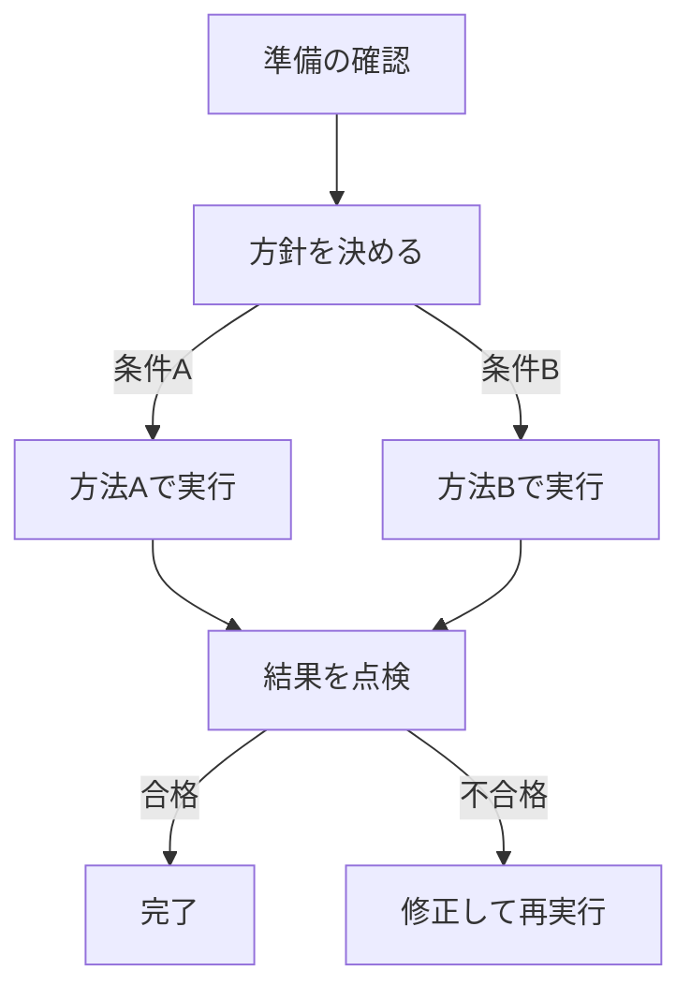

## 2. sequenceDiagram
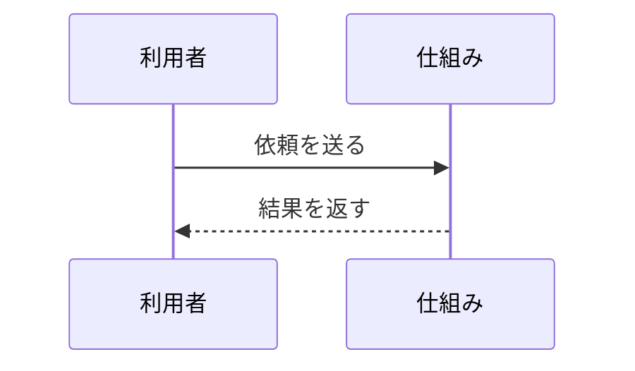

## 3. stateDiagram-v2
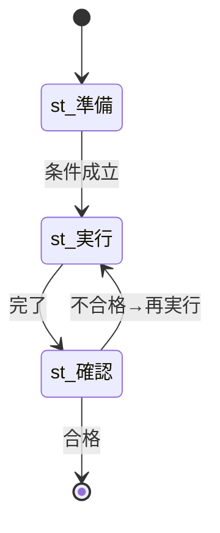

## 4. classDiagram
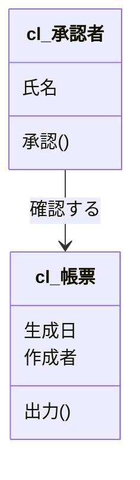

## 5. erDiagram
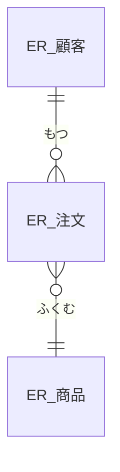

## 6. gantt
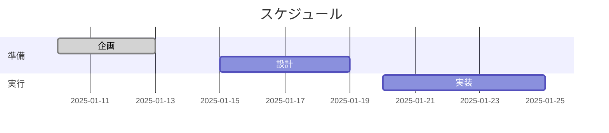

## 7. timeline
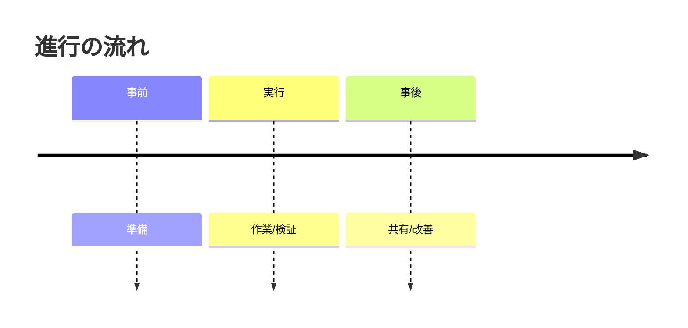

## 8. journey
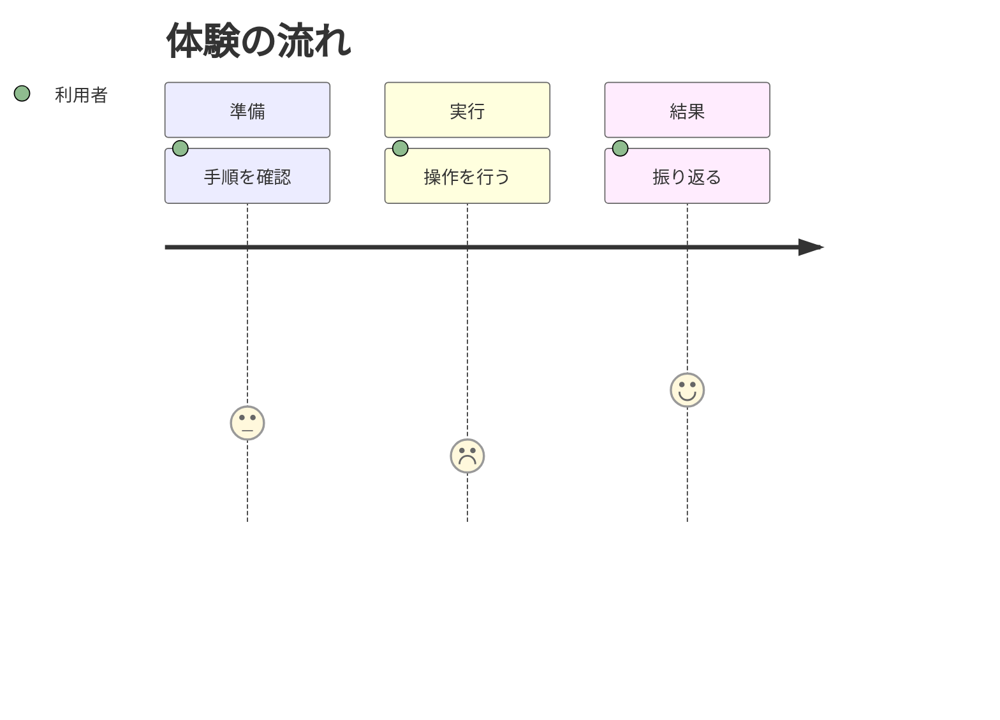

## 9. quadrantChart
```mermaid
quadrantChart
    title 優先度マップ
    x-axis 影響が小さい --> 影響が大きい
    y-axis 実行が難しい --> 実行が易しい
    qd_改善A: [1, 4]
    qd_改善B: [3, 2]
```

## 10. pie
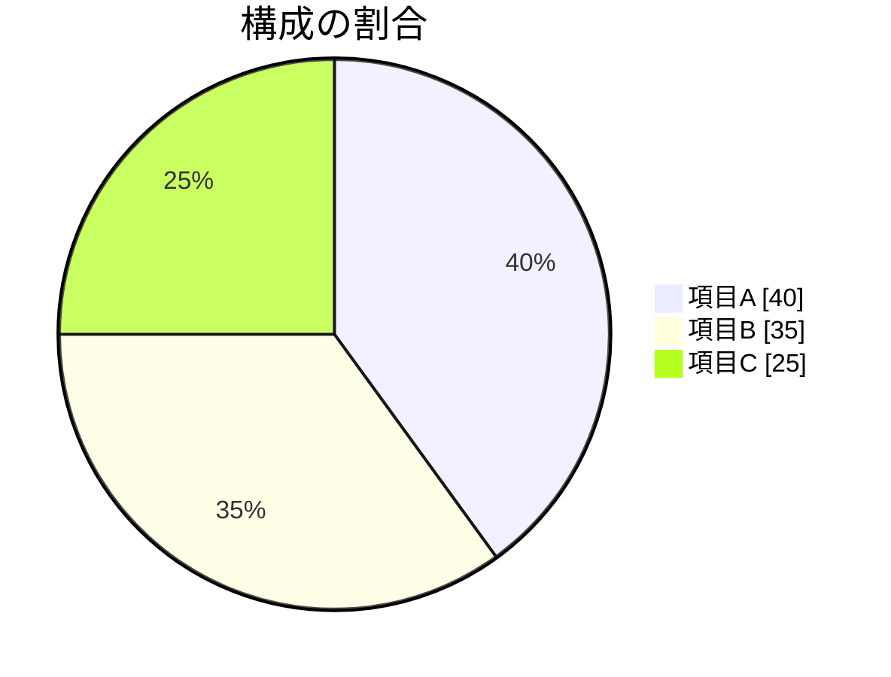

## 11. gitGraph


## 12. mindmap
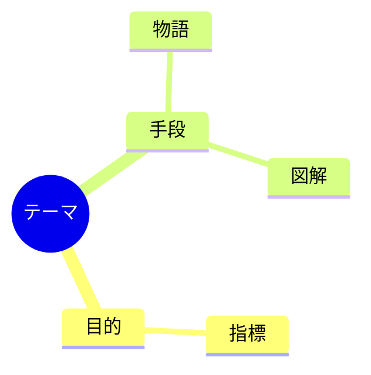

## 13. requirementDiagram
```mermaid
requirementDiagram
    requirement rq_要件A {
      説明: 目的を明確にする
      合否: 観察で確認
    }
    requirement rq_要件B {
      説明: 手順が再現できる
      合否: 実演で確認
    }
```

## 14. C4Context
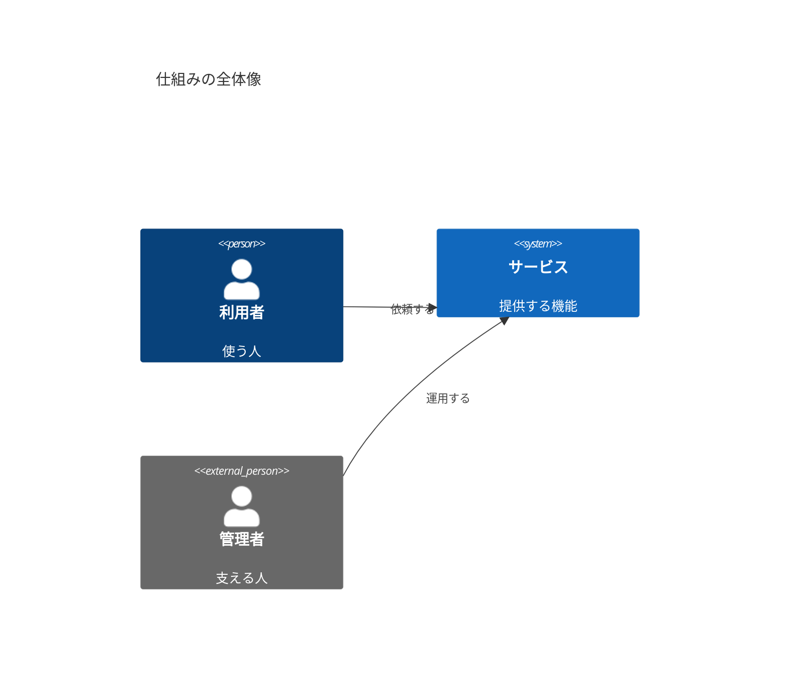