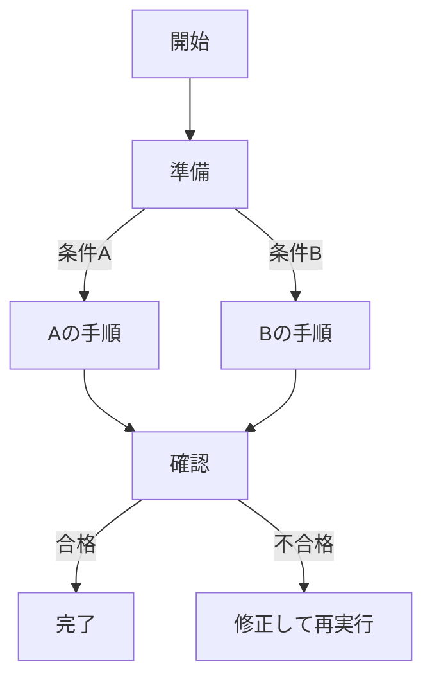

# サンプル資料
Mermaidコードをそのまま可視化するデモ。

## 手順フロー

```mermaid
flowchart TD
  start[開始] --> prep[準備]
  prep -->|条件A| pathA[Aの手順]
  prep -->|条件B| pathB[Bの手順]
  pathA --> check[確認]
  pathB --> check[確認]
  check -->|合格| done[完了]
  check -->|不合格| fix[修正して再実行]
```
他の文章は簡易に段落へ変換されます。
