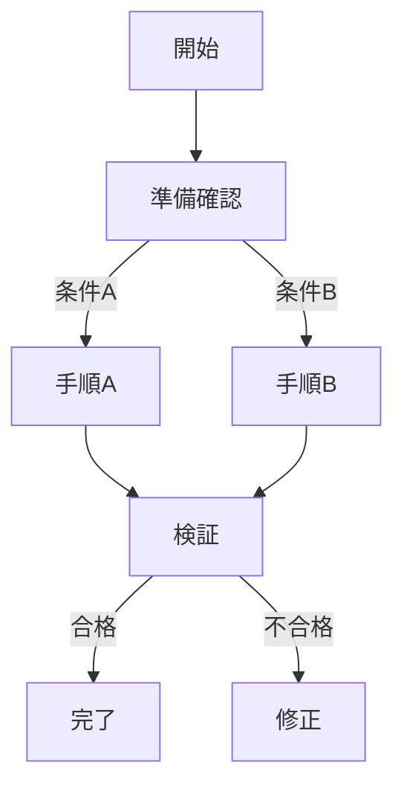
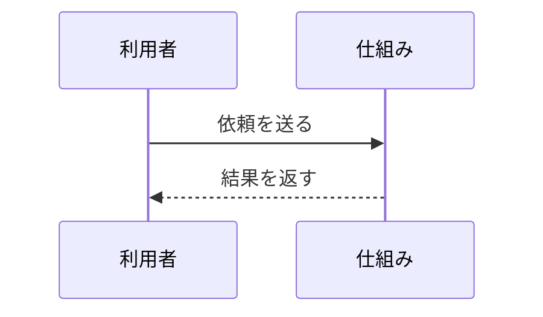
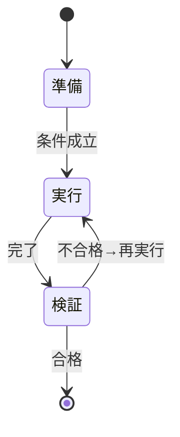
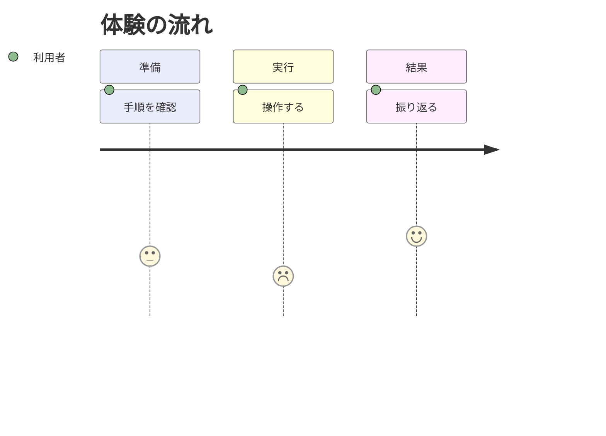
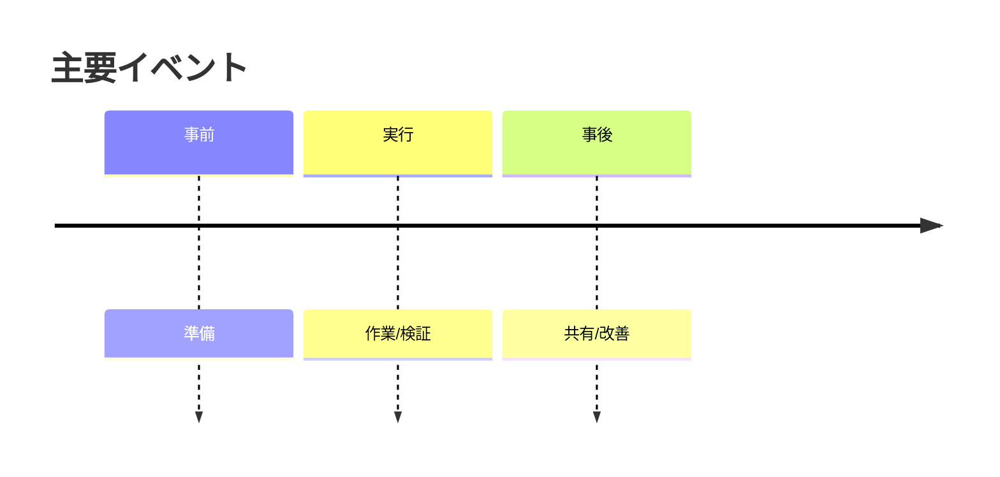

# GPT説明能力ブースト資料 ─ 追加知識・手法パック（拡張アドオン）
バージョン: 1.0 / 作成日: 2025-11-07

本資料は「専門外の人に伝わる説明デザイン完全ガイド」を強化するための**追加知識・運用手法・評価枠組み**をまとめたアドオンです。  
目的：GPTベースの説明生成の**精度・再現性・堅牢性・可読性**を底上げする。

---

## 目次
1. コア強化方針（設計原理の再確認）
2. 知識ベース拡張：種別と作り方
3. プロンプト強化：雛形・守破離
4. 自己点検（Self-Check）と合否条件
5. 図表生成の堅牢化（Mermaid運用・フォールバック）
6. 物語・比喩の品質向上術
7. 学習・保持の最大化（想起・間隔反復・転移）
8. 評価・計測：人手＋自動のハイブリッド
9. 制約下の最適化（音声・印刷・モバイル・色弱）
10. セキュリティ・倫理・プライバシー配慮
11. A/B比較・改善サイクル運用
12. 付録A：実運用チェックリスト総覧
13. 付録B：自己点検プロンプト（コピペ可）
14. 付録C：評価用JSONスキーマ（機械的検査）
15. 付録D：Mermaid安全テンプレ集（最小骨格）

---

## 1. コア強化方針（設計原理の再確認）
- **三層構造**を常に先に組む（TL;DR→5分→詳細）。後から中身を流し込む。
- **SCQA導入**で「なぜ今」から入る。受け手は理由がないと読まない。
- **一図一メッセージ**＋**直接ラベル**で即座に意味が取れる設計。
- **二重符号化**：図と文で同じメッセージをダブりなく伝える。
- **反例学習**：正例だけでは境界が学べない。反例を必ず並置。
- **想起優先**：読むより**思い出す**。各節末に30秒要約 or 3問クイズ。

---

## 2. 知識ベース拡張：種別と作り方
### 2.1 必須の知識モジュール（テンプレ付き）
- **用語カード**：定義/用途/似た語との違い/測定法/限界/例/反例（7項目）。
- **誤概念ライブラリ**：誤り→なぜ起きる→正しい理解→例→反例→再発防止フレーズ。
- **比喩ペア集**：源領域↔目標領域の部品・関係・制約の**対応表**＋破綻点。
- **場面別レシピ**：90秒/3分/5分/15分の**導入フック例**と**アウトライン**。
- **診断質問バンク**：不足情報を3問以内で特定する**分岐式**質問。
- **評価項目カタログ**：明確性/構造/視覚/正確性/関与/効果の観察指標。

### 2.2 作成のコツ
- 一項目は**A4半分以内**。後から統合しやすい粒度。
- **更新履歴**を残す（誤概念や比喩は時流で変わる）。
- 説明に使う図は**目的→型**が1対1で対応するよう整理。

---

## 3. プロンプト強化：雛形・守破離
### 3.1 最小プロンプト雛形（守）
```
目的＝{アウトカム}／受け手＝{対象}／制約＝{時間・媒体・端末}
必須：TL;DR→SCQA→用語5段階→5種図＋各10+物語→Why/What/How→注意点→テスト30→HTML
不足情報は最大3問で確認。未回答は「仮定」として明記して続行。
図は直接ラベル・ノードID名禁止。数値は単位・母数・比較基準セット。
```
### 3.2 応用（破）
- **出力の品質ルーブリック**を先に提示し、**自己採点**を最後に要求。
- **反例学習の義務化**：必ず1つ以上の反例と境界条件を書く。
- **転移セクション**：別領域での使い方を1例以上。

### 3.3 型破り（離）
- **A/B導入フック**（意外性 vs 身近な痛み）を併記し、仮説を宣言。

---

## 4. 自己点検（Self-Check）と合否条件
- **構造チェック**：5種以上の図があるか／各図に「10＋物語」か。
- **言語チェック**：ID名説明が残っていないか／曖昧語を具体化したか。
- **視覚チェック**：直接ラベル・強調1点・ゼロ起点・単位/母数/n明記。
- **学習チェック**：想起タスクと30問テストの整合。
- **限界チェック**：前提と境界・反例を明記。

---

## 5. 図表生成の堅牢化（Mermaid運用・フォールバック）
- **構文ルール厳守**（ID英字開始/ASCII英数+_ 等）。
- **フォールバック**：Mermaidが崩れた場合の代替出力を準備（表形式の擬似図、箇条書きフロー）。
- **ID衝突対策**：図ごとに**接頭辞**を付けたID（例：`fc_開始`）。
- **長文ラベル回避**：ラベルは**8–16字**程度＋詳細は本文で補完。

---

## 6. 物語・比喩の品質向上術
- **登場人物の動機**を明記（利得/損失/期限）。
- **因果の鎖**を3段階で書く（初期→一次→二次→最終）。
- **破綻点**を併記し比喩の過剰一般化を防ぐ。

---

## 7. 学習・保持の最大化（想起・間隔反復・転移）
- **想起**：各節末30秒要約/3問。  
- **間隔反復**：翌日→1週→1か月の保持クイズを自動用意。  
- **転移**：医療/金融/日常の**別領域**タスクを1つずつ。

---

## 8. 評価・計測：人手＋自動のハイブリッド
- **人手**：非専門家2名のパイロット。つまずき位置を記録。  
- **自動**：出力を**JSON検査**（図数/必須節/警告語）。  
- **A/B**：導入フックや図順序を変えて完了率・正答率比較。

---

## 9. 制約下の最適化（音声・印刷・モバイル・色弱）
- **音声**：略語にかみ砕き併記、記号語回避。  
- **印刷**：白黒でも読めるよう**形状・線種**で区別。  
- **モバイル**：見出しは短く、表は縦積み可能な構造。  
- **色弱**：赤緑同時使用回避、明度差を確保。

---

## 10. セキュリティ・倫理・プライバシー配慮
- **機微情報の最小化**、匿名化、合意の明示。  
- **不安喚起の乱用**は避け、ベースレートと比較で透明化。

---

## 11. A/B比較・改善サイクル運用
- 仮説→A/B版作成→指標（完了率/正答率/読了時間）→改善→再試験。

---

## 12. 付録A：実運用チェックリスト総覧
- 目的・構造・図・言語・学習・限界・倫理・配布の各項でYes/No式。

---

## 13. 付録B：自己点検プロンプト（コピペ可）
```
次の出力を自己点検してください。
1) 図は5種以上か。各図に10項目＋物語があるか。
2) 直接ラベルでノードID名の説明をしていないか。
3) 数字は単位・母数・比較基準の三点セットか。棒はゼロ起点か。
4) 反例・限界・前提が明記されているか。
5) テスト30問は配分（10/5/5/5/5）と解説を満たすか。
その結果を改善指示（箇条書き）として返し、すぐ修正稿を出力。
```

---

## 14. 付録C：評価用JSONスキーマ（機械的検査）
```json
{
  "structure": {
    "has_tldr": true,
    "has_scqa": true,
    "diagrams_count_min": 5,
    "sections_required": ["glossary","multi_view","why_what_how","pitfalls","quiz30","html_pack"]
  },
  "diagram_rules": {
    "no_node_ids_in_text": true,
    "direct_labels": true,
    "mermaid_syntax_ok": true
  },
  "numeracy": {
    "units_present": true,
    "denominator_present": true,
    "baseline_present": true,
    "zero_baseline_for_bars": true
  },
  "learning": {
    "recall_tasks_count_min": 3,
    "has_counterexamples": true,
    "transfer_examples_min": 1
  }
}
```

---

## 15. 付録D：Mermaid安全テンプレ集（最小骨格）
> **注**：ここでは**骨格のみ**を示します。実用時は「直接ラベル」で具体名に置換してください。

### 15.1 flowchart（TD）


### 15.2 sequenceDiagram


### 15.3 stateDiagram-v2


### 15.4 journey（体験）


### 15.5 timeline


---

### 参考：エラー時フォールバック（表形式）
```
時刻 | ステップ | 条件 | 次の行先
---- | ------- | ---- | --------
t0   | 準備    | OK   | 実行
t1   | 実行    | 失敗 | 修正→再実行
t2   | 検証    | 合格 | 完了
```

---

このアドオンを既存ガイドの後ろに統合すれば、GPTの説明生成は**再現性**と**堅牢性**が高まり、現場制約下でも崩れにくくなります。
